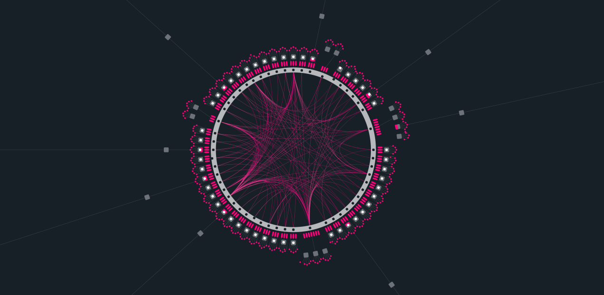
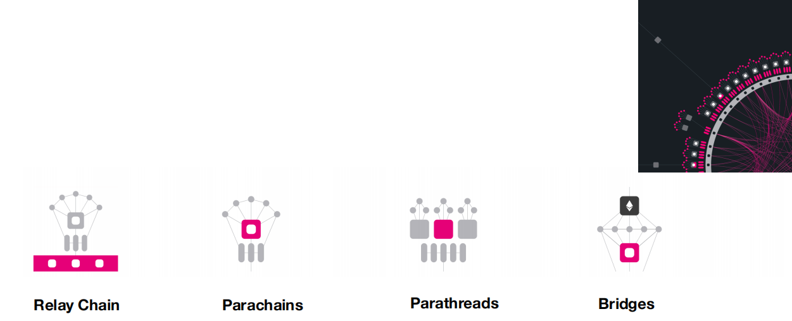
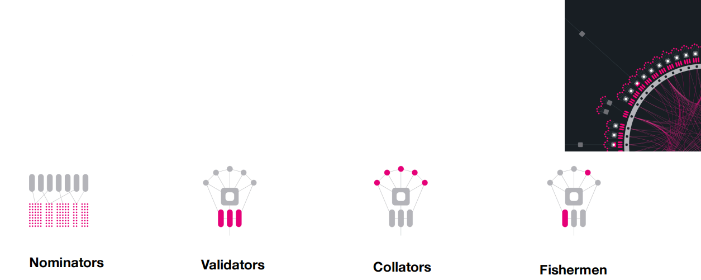
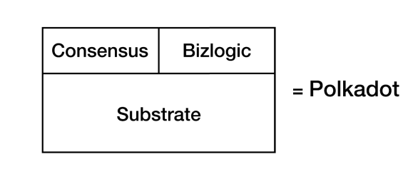
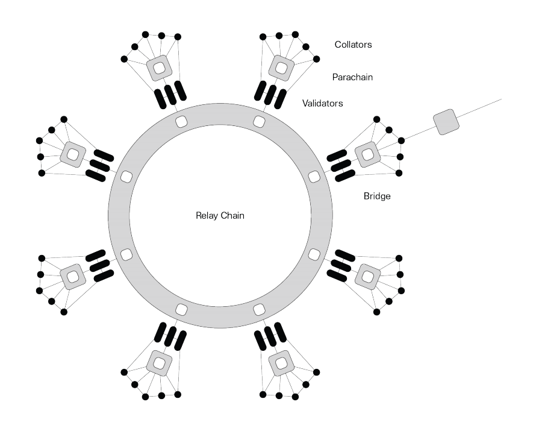

# Polkadot Cross-Chain Protocol: Overview

**Author:** Peile Wu  
**Email:** peile.wu.1990@gmail.com  
**Date:** November 9, 2025

---

## Why Learn Polkadot Cross-Chain Mechanism

- Interest in cross-chain protocols
- Better integration of Parachain with Relaychain via Cumulus
- Learn deep Substrate usage through Polkadot reference

## Common Questions

- What do collators do and their relationships with Parachain/Relaychain?
- What exactly crosses from Parachain to Relaychain?
- How do ~10 validators per chain ensure security?
- What is Pooled Security?
- Which cross-chain consensus data goes on-chain? What's the design basis?
- Which modules belong to Polkadot vs Substrate?
- Why using technology like VRF?
- What's Polkadot's ecosystem TPS?

---

## Polkadot Concept Overview

---

## Overall Architecture

**Relay Chain** - Polkadot's core; responsible for network security, consensus and cross-chain interoperability.

**Parachains** - Sovereign blockchains with own tokens; optimized for specific use cases and scenarios.

**Parathreads** - Like parachains but use pay-as-you-go fee model; more economical for blockchains not requiring continuous network connection.

**Bridges** - Allow parachains and parathreads to connect and communicate with external networks like Ethereum and Bitcoin.

---

## Consensus Participants

**Nominators** - Select trusted validators and stake DOTs to secure Relay Chain.

**Validators** - Verify collator proofs, stake DOTs, reach consensus with other validators to secure Relay Chain.

**Collators** - Collect parachain sharded transactions, provide proofs to validators to maintain shards.

**Fishermen** - Monitor network and report misbehavior to validators. Any collator or parachain full node can act as fisherman.

---

## Polkadot and Substrate Relationship

To enable ecosystem partners to quickly build parachains, Parity abstracts the generic logic of Polkadot, forming a Substrate.
Polkadot is then built upon this Substrate.

Polkadot codebase contains two major customized logic:

1. **Consensus**: Collation, collator, candidate receipt, commitment, executor, chunks, gossip, network protocol, availability store

2. **Business Logic**: Parachain lifecycle management, execution management, fundraising management, crowdfunding

---

## Cross-Chain Protocol Process: Availability and Validity

1. Parachain stage
2. Relay chain submission stage
3. Availability subprotocol
4. Secondary check in GRANDPA
5. Fisherman dispute procedure
6. Byzantine fault-tolerant finality gadget for final confirmation

---
