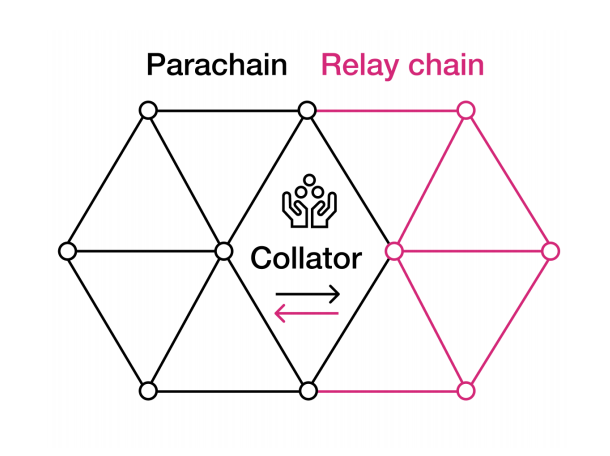
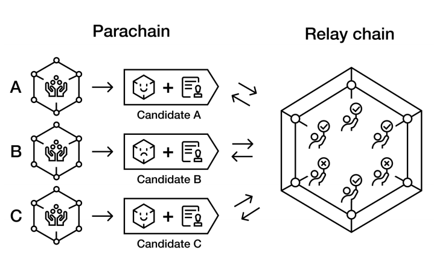

# Polkadot Cross-Chain Protocol: Parachain Phase

**Author:** Peile Wu  
**Email:** peile.wu.1990@gmail.com  
**Date:** November 9, 2025

---

## Network Architecture

- Collators are independent programs joining both Parachain and Relaychain P2P networks;
- Collators ferry information from Parachain to Relaychain as intermediate nodes

---

## Overall Process

- The parallel chain phase refers to the collator of the parallel chain proposing a candidate block to a group of validators currently assigned to that parallel chain.
- Collator nodes are active on a unique parallel chain, submitting state transition proposals and their validity proofs.
- A candidate block is a new block proposed by the collator of the parallel chain; it may be valid or invalid.
- Before being incorporated into the relay chain, it must undergo validity checks by the relay chain's validators.

---

## Collator Incentives

- Parachain only needs one honest collator to submit blocks
- From Relaychain perspective, collators don't need to stake DOTs
- Collators as collators have no rewards
- Economic rewards for collators (if any) need to be implemented on the Parachain
- Collators can also act as fishermen, which can provide corresponding rewards

---

## Testing Method

- In Polkadot's code repository, there is an [adder](https://github.com/paritytech/polkadot-sdk/tree/master/polkadot/parachain/test-parachains/adder) module used to simulate the simplest Parachain
- In actual use, Parachains need to reference [Cumulus](https://github.com/paritytech/polkadot-sdk/tree/master/cumulus) code repository to integrate it into Relaychain

## Code understanding

To be done.
