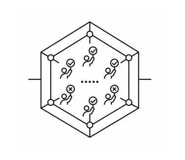

# Polkadot Cross-Chain Protocol: Relay Chain Phase

**Author:** Peile Wu  
**Email:** peile.wu.1990@gmail.com  
**Date:** November 10, 2025

---

## Validator Assignment and Slot Distribution

The relay chain organizes validator responsibilities through a slot-based system that ensures fair distribution and randomized assignment:

- Collators generate candidate blocks and transmit them to relay chain validators through the P2P network
- Each slot in the relay chain assigns validators to specific parachains for a given time period
- The number of validators per parachain is calculated using the formula: `validators_per_parachain = (validator_count - 1) / parachain_count`
- Validators are collectively responsible for verifying candidate blocks (parablock) submitted by collators

---

## Duty Roster and Validator Selection

The duty roster mechanism determines which validators are assigned to which parachains across different slots through a randomized but deterministic process:

- Each parachain receives an assigned set of validators
- Validator assignment is based on a pseudo-random number derived from the previous block
- The assignment follows a 'shuffle' algorithm
- Random assignment ensures that validators are randomly selected for each slot distribution, making each slot's validators unpredictable

---

## Verifiable Random Function (VRF)

VRF is a cryptographic primitive used in BABE to determine block validators in a way that is both verifiable and unpredictable:

- **VRF Definition:** A Verifiable Random Function that produces deterministic yet unpredictable outputs based on cryptographic commitments
- **Hash-based computation:** `result = hash(info)`
- **Keyed hash function:** `result = hash(SK, info)`
- **VRF hash function:** `result = vrf_hash(SK, info)`
- **VRF proof generation:** `proof = vrf_proof(SK, info)`
- **VRF verification:** `vrf_verify(PK, info, result, proof) -> T/F`
- **Key pair:** SK (secret key) and PK (public key) belong to each validator
- **Verifiability and Accountability:** Through VRF verification, it is possible to verify the correlation between info and result, while also determining which validator produced the signature

---

## VRF Application in Polkadot BABE

VRF is utilized in Polkadot's BABE (Blind Assignment for Blockchain Extension) protocol to determine block proposers through a randomized selection mechanism:

- `result = hash(SK, info)`
- `result = vrf_hash(SK, info)`
- `proof = vrf_proof(SK, info)`
- `vrf_verify(PK, info, result, proof) -> T/F`

**Result Threshold and Slot Assignment:**

- The result from VRF computation is compared against a threshold value. In Polkadot, the result must be smaller than a threshold to qualify the validator for block proposal in a given slot
- The info value in each slot is a globally fixed value for that slot period
- In Polkadot, info is referred to as `Ftranscript`, which concatenates multiple elements: one pseudo-random value (derived from the hash of N-2 epochs before combined with hashes), slot number, and epoch index

**Validator Slot Participation:**

- Since whether a validator is selected for a slot is determined by the VRF result, a validator may be assigned one slot, multiple slots, or no slots across different block production points:
  - **One slot (Primary slot leaders):** Normal case where a validator is selected as the primary block proposer
  - **Multiple slots (Grandpa finalization):** Multiple validators produce blocks; the grandpa consensus is then used to finalize which fork becomes the canonical chain
  - **Zero slots (Secondary slot leaders):** When no validator wins the VRF lottery for a slot, a round-robin mechanism determines a secondary block proposer

---

## Relay Chain Validation Process

The relay chain validates candidate blocks through a multi-stage process involving verification, commitment, and consensus:

1. **Receive Candidate Block:** Validators receive candidate blocks from collators
2. **State Transition Verification:** Use State Transition Function (STF) to verify whether the state transition is correct
3. **Broadcast Validation Results:** Validators broadcast commitment messages and block information to other validators
4. **Majority Consensus:** Once more than half of the assigned validators approve the candidate block, it is ready for receipt
5. **Compact Storage:** Use erasure coding techniques to store block data
6. **Send to Transaction Pool:** Deliver transactions to the transaction pool at the slot's intersection
7. **Package and Finalize:** Block points package the candidate receipt into a block for finalization

---
