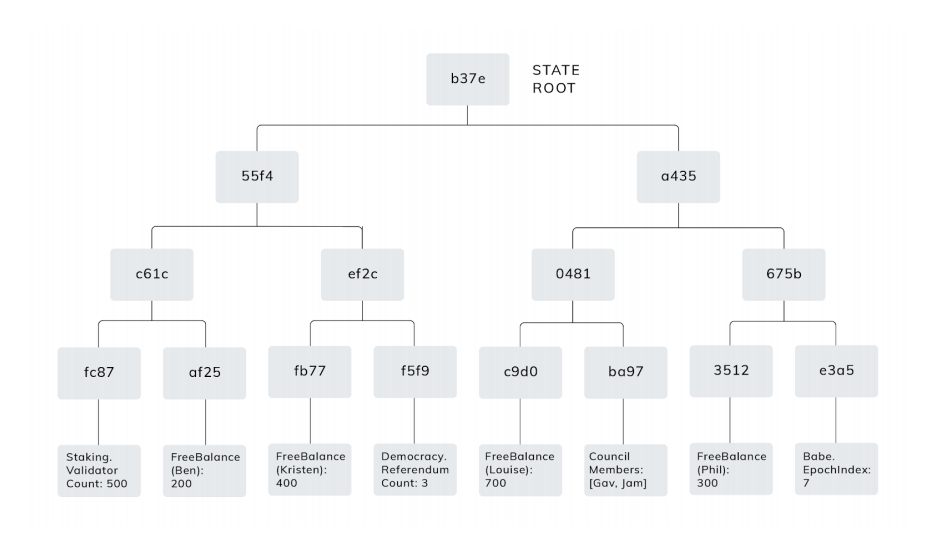
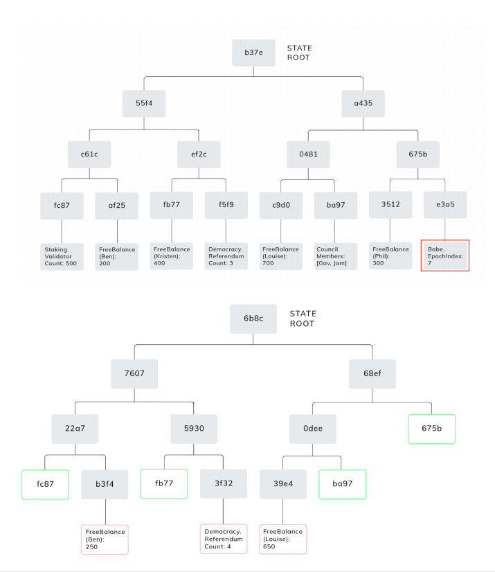
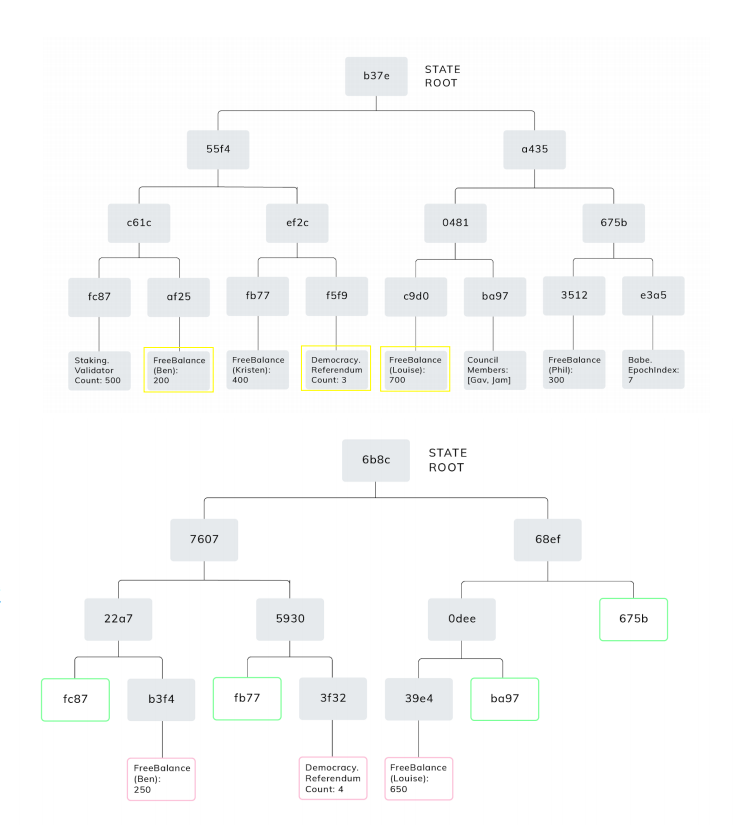
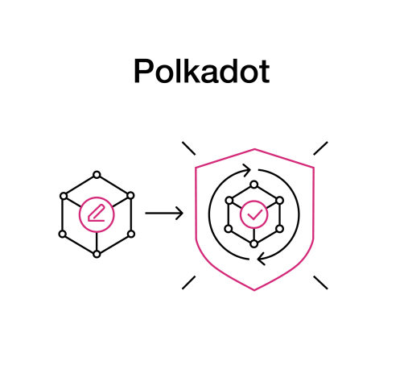
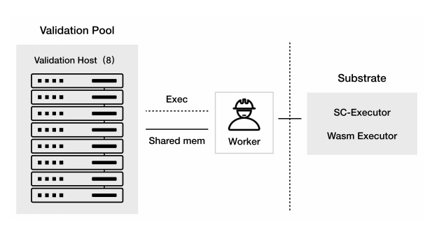

# Polkadot Cross-Chain Protocol: State Transition Function (STF)

**Author:** Peile Wu  
**Email:** peile.wu.1990@gmail.com  
**Date:** November 10, 2025

---

## STF - Merkle Tree

- Parachain state is stored in a structure called a Merkle tree
- All state values are leaf nodes of this tree
- For example: `Phil - FreeBalance: 300`
- Adjacent pairs of nodes take their hash values to trace upward
- All state traces lead to the state root (state root) - `b37e`

---

## STF - Verification

- **Merkle Property:** If a certain value is modified, only the hash values of affected nodes need to be recalculated, while unaffected branches remain unchanged
- **Hash Calculation Example:** `Hash(A1, A2, ..., A8) -> Hash(A1, A2, ..., A7, B8)`
- **Logarithmic Operations:** When A8 changes to B8 and other values remain unchanged, only 3 new hashes are needed instead of 7, requiring `log(n)` operations
- **Minimal State Access:** Based on this property, verification can validate state transitions without accessing the complete state. It only requires:
  - The value modified in the parachain database
  - Merkle proof ensuring unmodified values remain unaffected
  - This information constitutes a valid proof with fixed length
  - Unmodified values have no relationship with the proof, allowing them to represent all modifications

---

## STF - Verification Process

The concrete verification process on the relay chain:

- Collator provides the following data:

  - 1 Block (state transition table)
  - 2 Values modified in the parachain database, highlighted in yellow
  - 3 Merkle tree unmodified branch nodes, green-bordered content

- Among these: 1 is candidate_block, 2+3 is validity proof

- Relay chain validators, based on 2, 3, can calculate the parent block's state root S1

- Relay chain validators, using parachain's STF WASM runtime, based on modified state data - 2, verify from S1 to compute new values. Only the modified "2" content is replaced with the new value, red-bordered content - 4

- Based on 3, 4 calculate the current block's state root S2

- Compare (S1, S2) with state roots provided by collator. If they match, verification is successful

---

## STF - Trust Free Shared Security

- Polkadot verification process does not check every individual state value in parachains
- Through block execution, verification is performed on modified values to ensure changes are valid
- If a parachain's valid state is added to Polkadot and is under Polkadot security protection, all state transitions will have valid state
- Polkadot does not retain valid state, it guarantees valid state transitions occur
- **Parathreads**
- **Trust-Free**
- **Shared Security**

---

## STF - Executor

- Validators ultimately use an executor to perform STF verification
- Each validator has a `validation_pool`
- The pool can spawn up to 8 validation hosts
- During validation work, hosts create separate single-process workers via `exec` command with arguments: `validation_worker`
- Host and worker communicate through shared memory
- Workers ultimately invoke the execution stack: `substrate -> sc-executor -> wasm_executor` to perform STF verification

---
