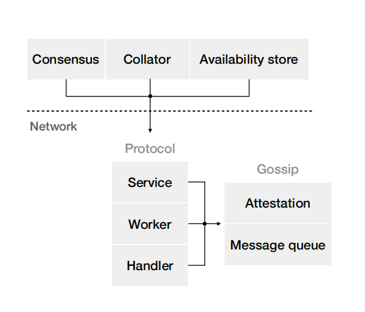
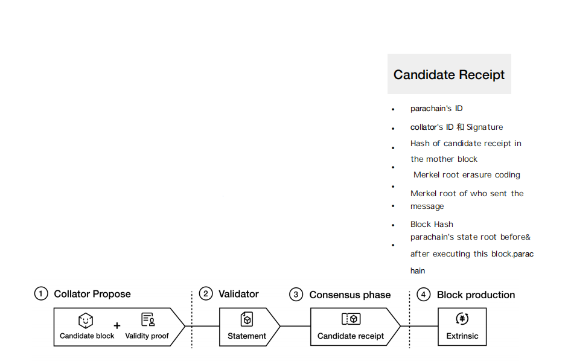
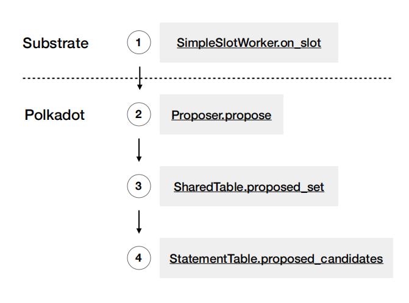

# Polkadot Cross-Chain Protocol: Customized Network Protocols

**Author:** Peile Wu  
**Email:** peile.wu.1990@gmail.com  
**Date:** November 10, 2025

---

## Broadcast Verification Results - Network Design

On the substrate network protocol, the Relay chain defines a standardized network protocol based on its own shared knowledge, building a set of deterministic network protocols.

The network protocol consists mainly of two component groups: `protocol` and `gossip`

- **Protocol Core:** The worker is the core of protocol, serving as the routing center for all messages
- **Handler:** Handler is the implementation layer of most logic, providing various trait implementations for the protocol to use
- **Service:** Service encapsulates the protocol and provides various trait implementations for the outside
- **Gossip Engine:** Gossip uses substrate's gossip engine to send messages
- **Gossip Main Functions:** Gossip implements two main functions:
  - **Attestation:** Message attestation
  - **Message Queue:** Message queue management

---

## Candidate Receipt

For each block of every parachain, the final receipt on the relay chain is called a candidate receipt.

- **Candidate Receipt Properties:** Candidate receipt is a large fixed-size piece of data
- **Receipt Composition:** Each entry contains ID, Hash, and Signature
- **State Expansion:** During parachain expansion, this is a linear process
- **Data Storage:** Block data, state data, erasure-coded data, etc., are all stored in a local key-value database called `availability-store`

### Candidate Receipt Contents

- parachain's ID
- collator's ID and Signature
- Hash of candidate receipt in the mother block
- Merkle root erasure coding
- Merkle root of who sent the message
- Block Hash
- parachain's state root before & after executing this block.parachains

---

## Block Production Process

The packaging block process involves multiple stages from slot assignment through block finalization:

1. **Collator Propose:** Collator proposes a candidate block and provides validity proof

2. **Validator:** Validators verify the statement and create validity statements

3. **Consensus Phase:** The consensus phase produces candidate receipts

4. **Block Production:** Extrinsic transactions are packaged into the relay chain block

---

## Packaging Block

- Once more than half of the validators approve, the candidate receipt is ready
- substrate on each slot, babe calls the slot's on_slot function
- Relay chain verification group in the block production stage

- **SharedTable:** Stores first-recognized knowledge - all processed program data validated, authorization data StatementTable, candidate receipt progress status, availability-store usage

- **StatementTable:** Stores first-recognized knowledge - validator signature data, not current misbehavior data, candidate vote data; all data are hash, sig, ID

- Block data, state data, erasure-coded data, etc., are stored in the local key-value database `availability-store`

- For babe block producer slot validator A, many candidate receipts appear in the transaction pool, need to verify:

  - candidate receipt's parent candidate has been received in the previous 2 blocks
  - A's local availability-store has already stored that candidate's erasure-coded chunk

- Based on babe finding slot's validator A, its transaction pool will have many candidate receipts, requiring verification:
  - candidate receipt's parent candidate has been received in previous blocks
  - A's local availability-store has stored that candidate's erasure-coded chunk

---
