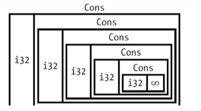
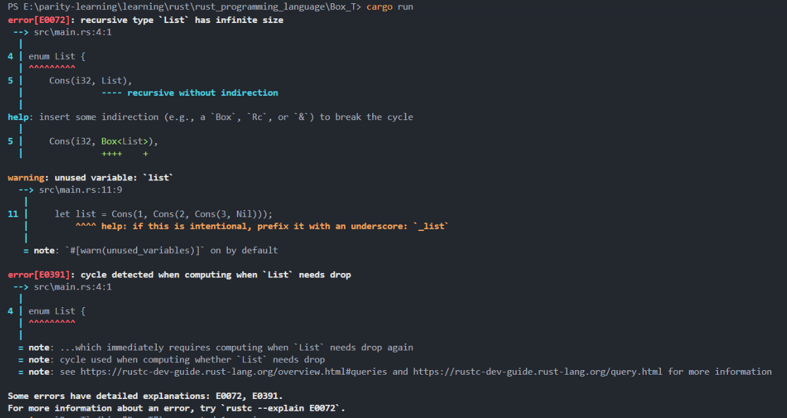
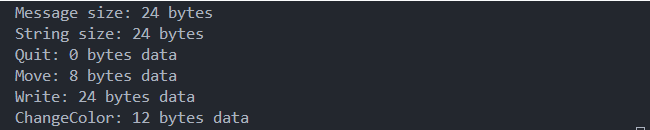
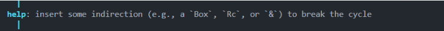
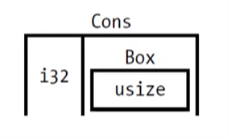

# Box<T> Smart Pointer Introduction

**Author:** Peile Wu  
**Contact:** peile.wu.1990@gmail.com  
**Date:** September 27, 2025

## Overview

`Box<T>` is the simplest smart pointer in Rust that allows you to store data on the heap memory. It consists of a small piece of memory on the stack containing a pointer that points to the data stored on the heap.

## Key Characteristics

- **No performance overhead**: Box<T> doesn't introduce additional runtime costs
- **No extra features**: It's minimal and focused on its core functionality
- **Smart pointer traits**: Implements both `Deref` and `Drop` traits
  - `Deref` trait: Allows treating Box values as references
  - `Drop` trait: Automatically cleans up both heap data and pointer data when Box goes out of scope

## Common Use Cases

1. **Unknown compile-time size**: When a type's size cannot be determined at compile time, but the context requires knowing the exact size
2. **Large data ownership transfer**: When you have a large amount of data and want to transfer ownership without copying the data during operations
3. **Trait object usage**: When you only care about whether a value implements a specific trait, not its concrete type

## Basic Usage Example

```rust
fn main() {
    let b = Box::new(5);
    println!("b = {}", b);
}
```

## Enabling Recursive Types with Box

### The Problem

Rust needs to know the size of a type at compile time, but recursive types have indeterminate sizes. This creates a compilation error as the compiler cannot calculate the memory requirement.

### The Solution

Since `Box<T>` is a pointer with a known size (regardless of the data it points to), we can use it to break the recursive cycle by adding "indirection" to the data structure.

## Cons List Example

### What is Cons List?

Cons List is a data structure from Lisp programming language where each member consists of two elements:

- The value of the current item
- The next element (of the same type)

The last member of a Cons List contains only a `Nil` value (termination marker, different from NULL) with no next element.



### Implementation Problems

Initial attempt (this will fail):

```rust
use crate::List::{Cons, Nil};

enum List {
    Cons(i32, List),  // This creates infinite size!
    Nil,
}

fn main() {
    let list = Cons(1, Cons(2, Cons(3, Nil)));
}
```

**Error:** `recursive type 'List' has infinite size`



### How Rust Determines Enum Size

For enum types, Rust calculates the size by:

1. Finding the largest variant
2. Considering memory alignment requirements

Example with `Message` enum:

```rust
enum Message {
    Quit,                           // 0 bytes
    Move { x: i32, y: i32 },       // 8 bytes
    Write(String),                  // 24 bytes (largest)
    ChangeColor(i32, i32, i32),    // 12 bytes
}
```

The enum size will be 24 bytes (the size of the largest variant) plus alignment considerations.



### Solving with Box<T>

The compiler suggests using "indirection" - storing a pointer to the data instead of the data directly.



**Corrected implementation:**

```rust
use crate::List::{Cons, Nil};

enum List {
    Cons(i32, Box<List>),  // Now uses Box for indirection
    Nil,
}

fn main() {
    let list = Cons(1, Box::new(Cons(2, Box::new(Cons(3, Box::new(Nil))))));
}
```

### Why Box<T> Works

- `Box<T>` is a pointer with a known, fixed size
- The pointer size doesn't change based on the size of the data it points to
- This breaks the infinite recursion in size calculation



## Memory Layout Comparison

### Without Box (Infinite size):

```
Cons -> Cons -> Cons -> Cons -> ...
```

### With Box (Fixed size):

```
Cons { i32, Box } -> Heap data: Cons { i32, Box } -> Heap data: ...
```

## Important Notes

- **Not a common Rust collection**: `Vec<T>` is usually a better choice for most use cases
- **Minimal functionality**: Box<T> only provides "indirection" and heap allocation
- **No performance overhead**: Clean and efficient implementation
- **Perfect for indirection scenarios**: Ideal when you need to break recursive type definitions

## Conclusion

`Box<T>` is a fundamental building block in Rust's ownership system, providing a simple yet powerful way to allocate data on the heap and enable recursive type definitions. While it's the simplest smart pointer, its role in enabling complex data structures makes it an essential tool in the Rust programmer's toolkit.

---

_This document is part of a Rust learning series focused on smart pointers and memory management._
