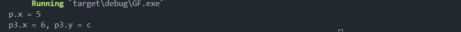

# Rust Generic Data Types Learning Guide

**Author:** Peile Wu  
**Email:** peile.wu.1990@gmail.com  
**Date:** September 12, 2025

## Table of Contents

- [Generic Overview](#generic-overview)
- [Generics in Structs](#generics-in-structs)
- [Generics in Functions and Methods](#generics-in-functions-and-methods)
- [Generics in Enums](#generics-in-enums)
- [Monomorphization Process](#monomorphization-process)
- [Performance Characteristics](#performance-characteristics)
- [Demo Output](#demo-output)

## Generic Overview

Generics are a crucial feature in Rust that provide code reuse capabilities. Through generics, we can write template-style code using placeholders `<T>` to represent types. The compiler replaces these placeholders with concrete types during compilation.

### Core Concepts

- **Type Parameters**: Usually represented by `T` (can also be other letters like `U`, `V`, `W`)
- **Naming Convention**: Uses CamelCase naming convention, where T is short for "type"
- **Compile-time Expansion**: Generic code is expanded into concrete type code during compilation

## Generics in Structs

### Single Type Parameter

```rust
struct Point<T> {
    x: T,
    y: T,
}

fn main() {
    let integer = Point { x: 5, y: 10 }; // Types must be the same
}
```

### Multiple Type Parameters

```rust
struct Point2<T, U> {
    x: T,
    y: U,
}

fn main() {
    let mix = Point2 { x: 1.0, y: "one" }; // Former is float, latter is String type
}
```

**Note**: If there are too many type parameters, consider reorganizing the code into multiple smaller units for better readability.

## Generics in Functions and Methods

### Generic Method Implementation

```rust
struct Point<T, U> {
    x: T,
    y: U,
}

impl<T, U> Point<T, U> {
    fn mixup<V, W>(self, other: Point<V, W>) -> Point<T, W> {
        Point {
            x: self.x,
            y: other.y,
        }
    }
}

fn main() {
    let p = Point { x: 5, y: Some(10) };
    println!("p.x = {}", p.x);

    let p1 = Point { x: 6, y: 8 };
    let p2 = Point { x: "Hello", y: "c" };
    let p3 = p1.mixup(p2);

    println!("p3.x = {}, p3.y = {}", p3.x, p3.y);
}
```

### Implementation Key Points

- Place the type parameter `<T>` after the `impl` keyword
- Can implement methods for specific types (e.g., `impl Point<i32>`)
- Type parameters in structs can be different from generic parameters in methods

## Generics in Enums

Generics in enums are mainly used to allow enum variants to hold generic data types:

### Option Enum

```rust
enum Option<T> {
    Some(T),
    None,
}
```

### Result Enum

```rust
enum Result<T, E> {
    Ok(T),
    Err(E),
}
```

## Monomorphization Process

Rust expands generic code into concrete type code during compilation through a process called **monomorphization**.

### Example Code

```rust
fn main() {
    let integer = Some(5);
    let float = Some(0.5); // Use Some() variants of Option enum, with T being i32 and f64 respectively
}
```

### Compiler Processing Steps

1. **Type Identification**: The compiler reads the usage of `Option<T>` and identifies two types:

   - `Option<i32>`
   - `Option<f64>`

2. **Code Expansion**: Expands the generic definition into concrete types:

   ```rust
   enum Option_i32 {
       Some(i32),
       None,
   }

   enum Option_f64 {
       Some(f64),
       None,
   }
   ```

3. **Function Transformation**: The original function is transformed to:
   ```rust
   fn main() {
       let integer = Option_i32::Some(5);
       let float = Option_f64::Some(0.5);
   }
   ```

## Performance Characteristics

- **Zero Runtime Overhead**: Code using generics runs at the same speed as code using concrete types
- **Compile-time Optimization**: All generic processing is completed during compilation, with no runtime performance impact
- **Code Bloat**: Monomorphization may increase binary size, but this is a space-time tradeoff

## Demo Output

Here's the output from running the `Generics_inFunction.rs` program, demonstrating the `mixup` method functionality:

The output shows:



This demonstrates how the `mixup` method takes two `Point` instances with different type combinations and creates a new `Point` using the `x` value from the first Point and the `y` value from the second Point. In this case:

- `p1` has `x: 6` (i32) and `y: 8` (i32)
- `p2` has `x: "Hello"` (&str) and `y: "c"` (&str)
- `p3` results in `x: 6` (from p1) and `y: "c"` (from p2)

## Best Practices

1. **Reasonable Type Parameter Count**: Avoid too many generic parameters to keep code simple
2. **Meaningful Parameter Naming**: While T is commonly used, consider more descriptive names in specific contexts
3. **Appropriate Abstraction Level**: Find the balance between code reuse and complexity

---

Through generics, Rust achieves a safe and efficient code reuse mechanism, which is an important feature of modern systems programming languages.
