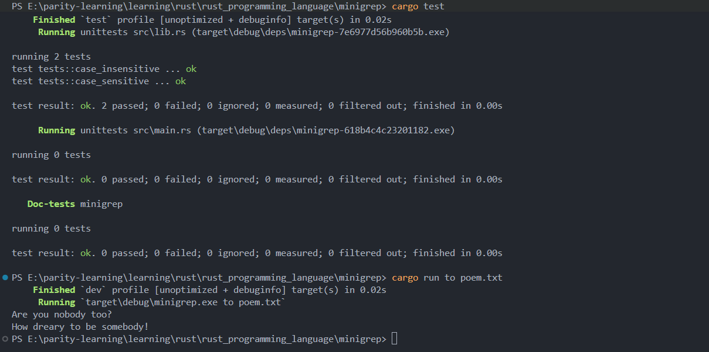

# Iterator

**Author:** Peile Wu  
**Contact:** peile.wu.1990@gmail.com  
**Date:** September 24, 2025

## Part 1: Iterator Trait and Next Method

### What is an Iterator?

The **Iterator Pattern** is a design pattern that allows you to perform certain tasks on each element in a series of items.

An iterator is responsible for:

- Traversing through each element
- Determining when the sequence (traversal) is complete

## Rust Iterators

Rust iterators are **lazy**: they have no effect unless you call methods that consume the iterator. In other words, if you don't use the iterator, it essentially does nothing.

### Basic Iterator Example

```rust
fn main() {
    let v1 = vec![1, 2, 3];

    // Currently v1_iter is not used, it has no iterative effect
    let v1_iter = v1.iter();

    // Each element in the iterator is used in the loop
    // Here 'val' takes ownership of v1_iter and makes it mutable internally
    for val in v1_iter {
        // The specific purpose is to print it out
        println!("Got: {}", val);
    }
}
```

## The Iterator Trait

All iterators implement the `Iterator` trait, which is defined in the standard library approximately as follows:

```rust
pub trait Iterator {
    type Item;

    fn next(&mut self) -> Option<Self::Item>;

    // methods with default implementations elided
}
```

### Key Components

- **`type Item`** and **`Self::Item`**: Define the associated type for this trait
- **Associated Type**: When implementing the `Iterator` trait, you need to define an `Item` type, which is used as the return type for the `next` method

### The `next` Method

The `Iterator` trait requires implementing only one method: `next`.

The `next` method:

- Returns one item from the iterator each time it's called
- Wraps the return result in `Some`
- Returns `None` when iteration is complete
- Can be called directly on iterators

### Practical Example

```rust
#[cfg(test)]
mod tests {
    #[test]
    fn iterator_demonstration() {
        let v1 = vec![5, 2, 3];

        /*
         * This iterator is modifiable, so add the mut keyword
         * Because when calling the next() method, it is equivalent to
         * changing the state of a record sequence position in the iterator
         * In other words, each call consumes an element in the iterator
         */
        let mut v1_iter = v1.iter();

        // Note: v1_iter.next() returns Option<&i32>
        assert_eq!(v1_iter.next(), Some(&5));
        assert_eq!(v1_iter.next(), Some(&2));
        assert_eq!(v1_iter.next(), Some(&3));
        assert_eq!(v1_iter.next(), None); // Iterator is exhausted
    }
}
```

## Different Iterator Methods

Rust provides several methods to create iterators with different behaviors:

### `iter()` Method

- Generates an iterator of **immutable references**
- Values obtained through `next()` calls are immutable references to vector elements
- The references are immutable, not the iterator itself

### `into_iter()` Method

- Takes **ownership** of elements during iteration
- Moves elements to a new scope and takes ownership of them

### `iter_mut()` Method

- Traverses elements using **mutable references**
- Allows modification of elements during iteration

## Key Takeaways

1. **Lazy Evaluation**: Iterators do nothing until consumed
2. **Mutability Requirement**: The iterator itself must be mutable to call `next()`
3. **State Management**: Each `next()` call changes the iterator's internal state
4. **Memory Safety**: Rust's ownership system ensures safe iteration patterns
5. **Flexibility**: Different iterator methods provide different levels of access to data

This foundation of iterator traits and the `next` method forms the basis for more advanced iterator patterns and functional programming techniques in Rust.

## Part 2: Consuming Adaptors and Iterator Adaptors

### Methods That Consume Iterators

The `Iterator` trait in the standard library provides several methods with default implementations. Some of these methods call the `next` method internally, which is why implementing the `next` method is mandatory when implementing the `Iterator` trait.

Methods that call `next` are called **"consuming adaptors"** because calling them consumes the iterator entirely.

#### The `sum` Method

The `sum` method is a prime example of a consuming adaptor that exhausts the iterator:

- Takes ownership of the iterator
- Repeatedly calls `next` to traverse all elements
- Adds each current element to a running total during iteration
- Returns the total sum when iteration ends

```rust
#[cfg(test)]
mod tests {
    #[test]
    fn iterator_sum() {
        let v1 = vec![1, 2, 3];
        let v1_iter = v1.iter();

        let total: i32 = v1_iter.sum();
        assert_eq!(total, 6);
    }
}
```

### Methods That Produce Other Iterators

Another category of methods defined on the `Iterator` trait are called **"iterator adaptors"**. These methods transform the current iterator into different types of iterators.

You can chain multiple iterator adaptors together to perform complex operations with high readability.

#### The `map` Method

The `map` method is a common iterator adaptor that:

- Takes a closure as an argument
- Applies the closure to each element
- Produces a new iterator with transformed elements

```rust
#[cfg(test)]
mod tests {
    #[test]
    fn iterator_adaptor() {
        let v1: Vec<i32> = vec![2, 3, 6];

        /*
         * Note: Iterators are lazy, they do nothing if nothing consumes them
         * That is, if consumable adaptor methods are not called, it will do nothing
         * Here we use the collect method as a consuming adaptor
         * Vec<_> means let the compiler infer the type inside this vector
         */
        let v2: Vec<_> = v1.iter().map(|x| x + 1).collect();
        assert_eq!(v2, vec![3, 4, 7]);
    }
}
```

#### The `collect` Method

The `collect` method is a consuming adaptor that:

- Consumes the iterator
- Collects the results into a collection type
- Is essential for materializing the results of iterator adaptors due to lazy evaluation

### Key Concepts

1. **Consuming Adaptors**: Methods like `sum` and `collect` that consume the entire iterator
2. **Iterator Adaptors**: Methods like `map` that transform iterators into new iterators
3. **Lazy Evaluation**: Iterator adaptors do nothing until consumed by a consuming adaptor
4. **Method Chaining**: Multiple iterator adaptors can be chained for complex transformations
5. **Type Inference**: Using `Vec<_>` allows the compiler to infer collection types

### Practical Applications

The combination of iterator adaptors and consuming adaptors enables functional programming patterns in Rust:

```rust
let numbers = vec![1, 2, 3, 4, 5];
let result: Vec<_> = numbers
    .iter()
    .map(|x| x * 2)           // Iterator adaptor: double each number
    .filter(|&x| x > 4)       // Iterator adaptor: keep numbers > 4
    .collect();               // Consuming adaptor: materialize results

// result = [6, 8, 10]
```

This approach provides both performance benefits through lazy evaluation and improved code readability through expressive method chaining.

## Part 3: Using Closures to Capture Environment

### The `filter` Method

The `filter` method is an iterator adaptor that demonstrates a common use case of closures capturing their environment. This method is particularly useful for conditional filtering based on external variables.

The `filter` method:

- Takes a closure as a parameter
- The closure returns a `bool` type when traversing each element of the iterator
- If the closure returns `true`: the current element will be included in the iterator produced by the `filter` method
- If the closure returns `false`: the current element will not be included in the filtered iterator

### Practical Example: Shoe Size Filtering

Here's a comprehensive example that demonstrates how closures can capture variables from their environment:

```rust
#[derive(PartialEq, Debug)]
struct Shoe {
    size: u32,
    style: String,
}

fn shoes_in_my_size(shoes: Vec<Shoe>, shoe_size: u32) -> Vec<Shoe> {
    shoes.into_iter().filter(|x| x.size == shoe_size).collect()
}

#[cfg(test)]
mod tests {
    use super::*;

    #[test]
    fn filter_by_size() {
        let shoes = vec![
            Shoe {
                size: 10,
                style: String::from("sneaker"),
            },
            Shoe {
                size: 13,
                style: String::from("sandal"),
            },
            Shoe {
                size: 10,
                style: String::from("boot"),
            },
        ];

        let in_my_size = shoes_in_my_size(shoes, 10);

        assert_eq!(
            in_my_size,
            vec![
                Shoe {
                    size: 10,
                    style: String::from("sneaker"),
                },
                Shoe {
                    size: 10,
                    style: String::from("boot"),
                },
            ]
        );
    }
}
```

### Understanding Closure Capture

In the example above, the closure `|x| x.size == shoe_size` captures the `shoe_size` parameter from its surrounding environment. This demonstrates several important concepts:

1. **Environment Capture**: The closure can access variables from its enclosing scope
2. **Immutable Borrowing**: The closure borrows `shoe_size` immutably
3. **Iterator Chaining**: Combining `into_iter()`, `filter()`, and `collect()` for data transformation
4. **Ownership**: Using `into_iter()` takes ownership of the vector elements

### Key Benefits

- **Flexibility**: Closures can capture any variable from their environment
- **Performance**: The filter operation is lazy and only processes elements when consumed
- **Readability**: The functional approach creates clear, expressive code
- **Memory Safety**: Rust's ownership system ensures safe access to captured variables

### Advanced Usage Patterns

```rust
// Capturing multiple variables
let min_size = 8;
let max_size = 12;
let medium_shoes: Vec<_> = shoes
    .into_iter()
    .filter(|shoe| shoe.size >= min_size && shoe.size <= max_size)
    .collect();

// Chaining multiple filters
let specific_shoes: Vec<_> = shoes
    .into_iter()
    .filter(|shoe| shoe.size == 10)
    .filter(|shoe| shoe.style.contains("boot"))
    .collect();
```

This part demonstrates how Rust's closures provide a powerful mechanism for creating flexible, reusable filtering logic that can adapt to different environmental conditions while maintaining memory safety and performance.

## Part 4: Creating Custom Iterators with Iterator Trait

### Implementing Custom Iterators

Creating a custom iterator in Rust requires only one step: **implementing the `next` method**. Once you provide this implementation, all other iterator methods become automatically available through the trait's default implementations.

### Counter Example: A Simple Custom Iterator

Here's a complete implementation of a custom iterator that counts from 1 to 5:

```rust
use std::iter::Iterator;

struct Counter {
    count: u32,
}

impl Counter {
    fn new() -> Counter {
        Counter { count: 0 }
    }
}

// Custom Iterator implementation for Counter struct
impl Iterator for Counter {
    type Item = u32;

    fn next(&mut self) -> Option<Self::Item> {
        if self.count < 5 {
            self.count += 1;
            Some(self.count)
        } else {
            None
        }
    }
}
```

### Testing the Custom Iterator

#### Direct `next()` Method Calls

```rust
#[test]
fn calling_next_directly() {
    let mut counter = Counter::new();

    assert_eq!(counter.next(), Some(1));
    assert_eq!(counter.next(), Some(2));
    assert_eq!(counter.next(), Some(3));
    assert_eq!(counter.next(), Some(4));
    assert_eq!(counter.next(), Some(5));
    assert_eq!(counter.next(), None);
}
```

#### Using Iterator Trait Methods

Once you implement the `Iterator` trait, all iterator methods become available:

```rust
#[test]
fn using_other_iterator_trait_methods() {
    let sum: u32 = Counter::new()
        /*
         * 'zip' method takes two iterators and links each pair of elements
         * together to form tuples. First iterator: Counter([1,2,3,4,5]).
         * Second iterator: Counter with skip(1) = [2,3,4,5].
         * After 'zip': [(1,2), (2,3), (3,4), (4,5)]
         * After 'map': [2, 6, 12, 20] (a * b for each pair)
         * After 'filter': [6, 12] (numbers divisible by 3)
         * After 'sum': 18
         */
        .zip(Counter::new().skip(1))
        .map(|(a, b)| a * b)
        .filter(|x| x % 3 == 0)
        .sum();

    assert_eq!(18, sum);
}
```

### Breaking Down the Complex Chain

Let's trace through the complex iterator chain step by step:

1. **`Counter::new()`** → `[1, 2, 3, 4, 5]`
2. **`Counter::new().skip(1)`** → `[2, 3, 4, 5]`
3. **`.zip(...)`** → `[(1,2), (2,3), (3,4), (4,5)]`
4. **`.map(|(a, b)| a * b)`** → `[2, 6, 12, 20]`
5. **`.filter(|x| x % 3 == 0)`** → `[6, 12]`
6. **`.sum()`** → `18`

### Key Implementation Requirements

When implementing the `Iterator` trait:

1. **Associated Type**: Define `type Item` to specify what the iterator yields
2. **`next` Method**: Return `Some(item)` for valid items, `None` when exhausted
3. **Mutable State**: The `next` method takes `&mut self` to modify internal state
4. **Termination**: Ensure the iterator eventually returns `None` to avoid infinite loops

### Benefits of Custom Iterators

- **Lazy Evaluation**: Your iterator only computes values when requested
- **Memory Efficiency**: No need to store all values in memory at once
- **Composability**: Automatic access to all iterator adaptor methods
- **Zero-Cost Abstractions**: Rust optimizes iterator chains to efficient loops
- **Reusability**: Can be used with any iterator-consuming code

### Advanced Custom Iterator Patterns

```rust
// Iterator that yields Fibonacci numbers
struct Fibonacci {
    current: u64,
    next: u64,
}

impl Fibonacci {
    fn new() -> Self {
        Fibonacci { current: 0, next: 1 }
    }
}

impl Iterator for Fibonacci {
    type Item = u64;

    fn next(&mut self) -> Option<Self::Item> {
        let current = self.current;
        self.current = self.next;
        self.next = current + self.next;
        Some(current)
    }
}
```

Custom iterators unlock the full power of Rust's functional programming capabilities while maintaining zero-cost abstractions and memory safety.

## Part 5: Real-World Application - Improving Minigrep with Iterators

### Project Overview: Minigrep Optimization

This section demonstrates how to refactor a real-world CLI application (minigrep) to leverage iterators for improved performance and code clarity. The minigrep project is a simplified version of the `grep` command-line tool that searches for text patterns in files.

### Key Improvements Made

The refactoring involved two main areas:

1. **Command-line argument parsing** - Using iterator methods instead of indexing
2. **Text search functionality** - Replacing explicit loops with iterator chains

### 1. Optimizing Command-Line Argument Parsing

#### Before: Vector Indexing Approach

```rust
// Original implementation
pub fn new(args: &[String]) -> Result<Config, &'static str> {
    if args.len() < 3 {
        return Err("Not enough arguments ...");
    }

    let query = args[1].clone();
    let filename = args[2].clone();

    // ... rest of implementation
}

// In main.rs
let args: Vec<String> = env::args().collect();
let config = Config::new(&args).unwrap_or_else(|err| {
    eprintln!("Problem parsing arguments: {}", err);
    process::exit(1);
});
```

#### After: Iterator-Based Approach

```rust
// Improved implementation with iterators
pub fn new(mut args: std::env::Args) -> Result<Config, &'static str> {
    // Skip the program name (first argument)
    args.next();

    // Get the query parameter by calling next()
    let query = match args.next() {
        Some(arg) => arg,
        None => return Err("Didn't get a query string"),
    };

    // Get the filename parameter by calling next()
    let filename = match args.next() {
        Some(arg) => arg,
        None => return Err("Didn't get a file name"),
    };

    // ... rest of implementation
}

// In main.rs - Direct iterator usage
let config = Config::new(env::args()).unwrap_or_else(|err| {
    eprintln!("Problem parsing arguments: {}", err);
    process::exit(1);
});
```

#### Benefits of Iterator Approach:

1. **Memory Efficiency**: No need to collect all arguments into a vector
2. **Ownership**: Arguments are moved rather than cloned
3. **Better Error Handling**: More specific error messages for missing arguments
4. **Lazy Evaluation**: Only processes arguments as needed

### 2. Optimizing Text Search Function

#### Before: Explicit Loop Implementation

```rust
pub fn search<'a>(query: &str, contents: &'a str) -> Vec<&'a str> {
    let mut results = Vec::new();

    for line in contents.lines() {
        if line.contains(query) {
            results.push(line);
        }
    }

    results
}
```

#### After: Functional Iterator Chain

```rust
pub fn search<'a>(query: &str, contents: &'a str) -> Vec<&'a str> {
    contents
        .lines()                           // Iterator over lines
        .filter(|line| line.contains(query)) // Keep matching lines
        .collect()                         // Collect into vector
}
```

#### Analysis of the Iterator Chain:

1. **`.lines()`** - Creates an iterator over lines in the text
2. **`.filter(|line| line.contains(query))`** - Keeps only lines containing the query
3. **`.collect()`** - Materializes the filtered results into a vector

### Performance and Readability Benefits

#### Performance Improvements:

- **Zero-cost abstractions**: The compiler optimizes iterator chains into efficient loops
- **Reduced allocations**: No intermediate vector creation during filtering
- **Lazy evaluation**: Only processes matching lines

#### Code Quality Improvements:

- **Declarative style**: Code expresses _what_ to do rather than _how_
- **Reduced mutability**: No need for mutable `results` vector
- **Fewer lines**: More concise and expressive
- **Less error-prone**: No manual loop management

### Complete Example Integration

```rust
use std::env;
use std::process;

// lib.rs
impl Config {
    pub fn new(mut args: std::env::Args) -> Result<Config, &'static str> {
        args.next(); // Skip program name

        let query = match args.next() {
            Some(arg) => arg,
            None => return Err("Didn't get a query string"),
        };

        let filename = match args.next() {
            Some(arg) => arg,
            None => return Err("Didn't get a file name"),
        };

        let case_sensitive = env::var("CASE_INSENSITIVE").is_err();

        Ok(Config { query, filename, case_sensitive })
    }
}

pub fn search<'a>(query: &str, contents: &'a str) -> Vec<&'a str> {
    contents
        .lines()
        .filter(|line| line.contains(query))
        .collect()
}

// main.rs
fn main() {
    let config = Config::new(env::args()).unwrap_or_else(|err| {
        eprintln!("Problem parsing arguments: {}", err);
        process::exit(1);
    });

    // ... rest of main function
}
```

### Key Takeaways

1. **Direct Iterator Usage**: `env::args()` returns an iterator that can be used directly
2. **Ownership Benefits**: Iterator approach avoids unnecessary cloning
3. **Error Handling**: More specific error messages improve user experience
4. **Functional Programming**: Iterator chains create more expressive code
5. **Performance**: Zero-cost abstractions provide efficiency without sacrificing readability

This refactoring demonstrates how iterators can transform imperative code into functional, efficient, and maintainable Rust code while leveraging the language's zero-cost abstraction philosophy.

### Project Structure and Testing Results

#### Updated Directory Structure

```
Iterator/
├── img/
│   └── Optimizing_minigrep_byIterator.png
├── src/
│   ├── lib.rs
│   └── main.rs
├── tests/
│   ├── custom_iterators.rs
│   └── iter_capture_closure.rs
├── Cargo.lock
├── Cargo.toml
└── iterator_introduction.md
```

#### Test Execution Results

The optimized minigrep implementation passes all tests successfully:



#### Functional Test Verification

The application works correctly with real text processing:

```bash
PS E:\parity-learning\learning\rust\rust_programming_language\minigrep> cargo run to poem.txt
    Finished `dev` profile [unoptimized + debuginfo] target(s) in 0.02s
     Running `target\debug\minigrep.exe to poem.txt`
Are you nobody too?
How dreary to be somebody!
```

#### Key Observations

1. **All Tests Pass**: Both case-sensitive and case-insensitive search functionality work correctly
2. **Fast Compilation**: The iterator-based implementation compiles quickly (0.02s)
3. **Working Functionality**: Real text search demonstrates the practical benefits
4. **Clean Output**: The optimized search function correctly identifies matching lines

The successful test results confirm that the iterator-based refactoring maintains all original functionality while providing the performance and readability benefits discussed in the previous sections. The zero-cost abstraction principle is demonstrated through the unchanged behavior and maintained performance characteristics.
