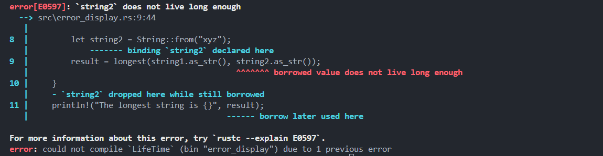
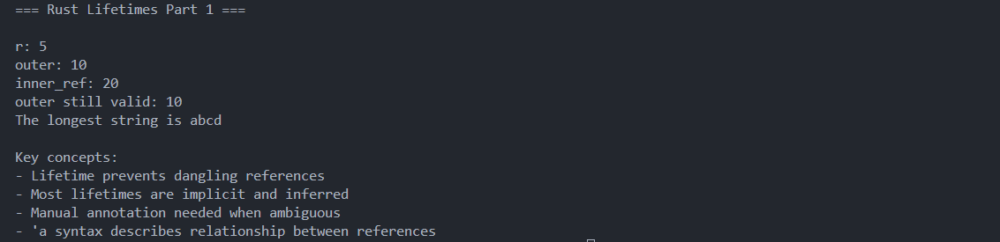
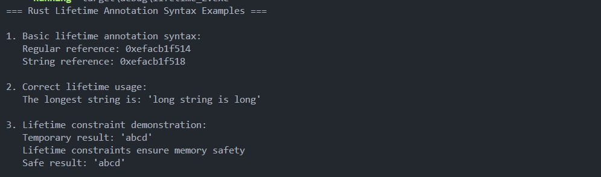

# Rust Lifetime Introduction

**Author:** Peile Wu  
**Contact:** peile.wu.1990@gmail.com  
**Date:** September 14, 2025

# Part 1

## What is Lifetime?

Every reference in Rust has its own **lifetime**.

**Lifetime**: the scope for which a reference remains valid.

- Most of the time: lifetimes are implicit and can be inferred
- When reference lifetimes may relate to each other in different ways: manual lifetime annotation is required
- Main goal of lifetimes: **prevent dangling references**

## Dangling Reference Problem

```rust
fn main() {
    let r;              // r declared without initialization

    {
        let x = 5;
        r = &x;         // Error: borrowed value does not live long enough
    }                   // x is dropped here while still borrowed

    println!("r: {}", r); // borrow later used here
}
```

**Execution flow:**

1. Declare `r` in outer scope (uninitialized)
2. Enter inner scope `{}`
3. Create variable `x = 5`
4. Let `r` reference `x`'s memory address: `r = &x`
5. Leave inner scope, `x` is destroyed
6. Try to print `r`, but the memory `r` points to is now invalid

**Rust compiler error:**

```
error[E0597]: `x` does not live long enough
 --> src/main.rs:6:9
  |
6 |     r = &x;
  |         ^^ borrowed value does not live long enough
7 |     }
  |       - `x` dropped here while still borrowed
8 |     println!("r: {}", r);
  |                       - borrow later used here
```

## Core Concept

This example demonstrates Rust's **lifetime** concept:

- `x`'s lifetime is limited to the inner scope
- `r`'s lifetime extends to the outer scope
- Rust doesn't allow a reference's lifetime to exceed the lifetime of the referenced object

We can name the lifetimes of `r` and `x` as `'a` and `'b` respectively:

- `r` has lifetime `'a` (longer)
- `x` has lifetime `'b` (shorter)

During compilation, Rust compiler compares the lengths of `'a` and `'b`, finds that `r`'s lifetime (`'a`) points to `x`'s lifetime (`'b`), but the referenced object `x` has a shorter lifetime than its reference `r`, so compilation fails.

**Solution**: Make `'b` no shorter than `'a` by moving `x`'s definition before `r`.

## Generic Lifetimes in Functions

```rust
fn main() {
    let string1 = String::from("abcd");
    let string2 = "xyz";

    let result = longest(string1.as_str(), string2);
    println!("The longest string is {}", result);
}

fn longest(x: &str, y: &str) -> &str {  // Error: missing lifetime specifier
    if x.len() > y.len() {
        x
    } else {
        y
    }
}
```

Although the logic is simple, this code produces an error because the compiler doesn't know the lifetimes of parameters `x` and `y`.

**Solution**: Add a generic lifetime parameter

```rust
fn longest<'a>(x: &'a str, y: &'a str) -> &'a str {
    if x.len() > y.len() {
        x
    } else {
        y
    }
}
```

This indicates that the return type and both `x` and `y` have the same lifetime `'a`.

## Key Points

- Lifetimes ensure memory safety by preventing dangling references
- Most lifetimes are inferred automatically by the compiler
- Manual lifetime annotation is needed when the compiler cannot determine the relationship between references
- Lifetime parameters describe the relationship between references, not their actual duration
- The `'a` syntax is used to name lifetime parameters

---

# Part 2

## Lifetime Annotation Syntax

Lifetime annotations **do not change the length of reference lifetimes**. When generic lifetime parameters are specified, functions can accept references with any lifetime.

### Key Concepts

- **Lifetime annotations**: Describe the relationships between lifetimes of multiple references
- **Do not affect**: The actual lifetime lengths
- **Purpose**: Provide constraint information for the borrow checker

### Annotation Syntax

Lifetime parameter naming convention:

- Starts with `'` (apostrophe)
- Usually lowercase and very short (many developers use `'a`)

Lifetime annotation positions:

- Placed after the `&` symbol
- Use space to separate annotation from reference type

Examples:

```rust
&i32         // A reference
&'a i32      // A reference with explicit lifetime
&'a mut i32  // A mutable reference with explicit lifetime
```

**Note**: A single lifetime annotation by itself has no meaning.

## Function Signatures with Lifetime Annotations

Generic lifetime parameters are declared in `<>` between the function name and parameter list. This expresses that both parameters and the return value must have the same lifetime `'a`.

```rust
fn longest<'a>(x: &'a str, y: &'a str) -> &'a str {
    if x.len() > y.len() {
        x
    } else {
        y
    }
}
```

**What this function signature tells Rust:**

- There is a lifetime `'a`
- Both string slice parameters must live at least as long as `'a`
- The return value also has lifetime `'a`

**Important**: When we specify lifetime parameters in function signatures, we haven't changed the lifetimes of input values and return values. We're just providing constraints to the borrow checker for detecting illegal calls.

The `longest` function doesn't need to know the specific lifetime durations of parameters `x` and `y` (after adding constraints).

**Detail**: When we pass concrete references to the `longest` function, the scope used to replace lifetime `'a` is the smaller of the lifetimes of `x` and `y`.

**The actual lifetime of `'a`** is the smaller of the two lifetimes `x` and `y`.

## Demonstrating Lifetime Constraints

### Error Example

The following code demonstrates why lifetime constraints are necessary:

```rust
fn main() {
    let string1 = String::from("abcd");
    let result;

    {
        // Previously this was let string2 = "xyz";
        // But note: the lifecycle of a string literal runs through the entire program
        let string2 = String::from("xyz");
        result = longest(string1.as_str(), string2.as_str());
    }
    println!("The longest string is {}", result);
}

fn longest<'a>(x: &'a str, y: &'a str) -> &'a str {
    if x.len() > y.len() {
        x
    } else {
        y
    }
}
```

**Compiler Error:**



**Why this error occurs:**
For `result` to be valid when printed on line 11, `string2` must remain valid until the outer scope ends. Since both function parameters and return value use the same lifetime parameter `'a`, Rust identifies this problem.

Even though the function actually returns `string1` (which has 4 characters and is clearly longer), the Rust compiler doesn't know this. It only knows that the `longest` function's return value lifetime is the shorter of `x` and `y` lifetimes, but here the shorter `string2` lifetime doesn't extend to support printing `result`.

## Working Examples

### Example 1: Basic Usage

```rust
fn main() {
    let string1 = String::from("long string is long");
    let string2 = String::from("xyz");

    // This works fine because both strings are in the same scope
    let result = longest(string1.as_str(), string2.as_str());
    println!("The longest string is: '{}'", result);
}
```

### Example 2: Safe Constraint Demonstration

```rust
fn main() {
    let string1 = String::from("abcd");

    {
        let string2 = String::from("xyz");
        // Using within this scope is safe
        let temp_result = longest(string1.as_str(), string2.as_str());
        println!("Temporary result: '{}'", temp_result);
    }

    // This works because string literals have 'static lifetime
    let result_safe = longest(string1.as_str(), "xyz");
    println!("Safe result: '{}'", result_safe);
}
```

## Runtime Output Examples

### Successful Compilation and Execution

When running the corrected lifetime examples (`lifetime_1.rs`):



### Advanced Examples Output

When running lifetime annotation syntax examples (`lifetime_2.rs`):



## Summary

**Lifetime annotations provide:**

1. **Syntax**: Starting with `'`, usually short names like `'a`
2. **Placement**: After `&` symbol, separated by space
3. **Function signatures**: Generic parameters in `<>` between name and parameters
4. **Constraints**: All references with same lifetime parameter must satisfy constraints
5. **Safety**: Compile-time checks prevent dangling references and memory safety issues

**Remember**: Lifetime annotations describe relationships between references without changing their actual durations. The compiler uses these annotations to ensure memory safety at compile time.
