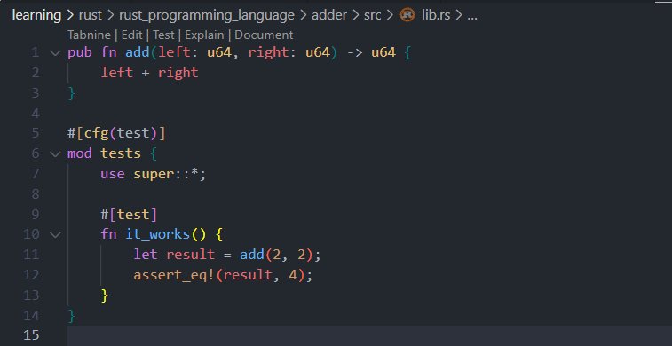
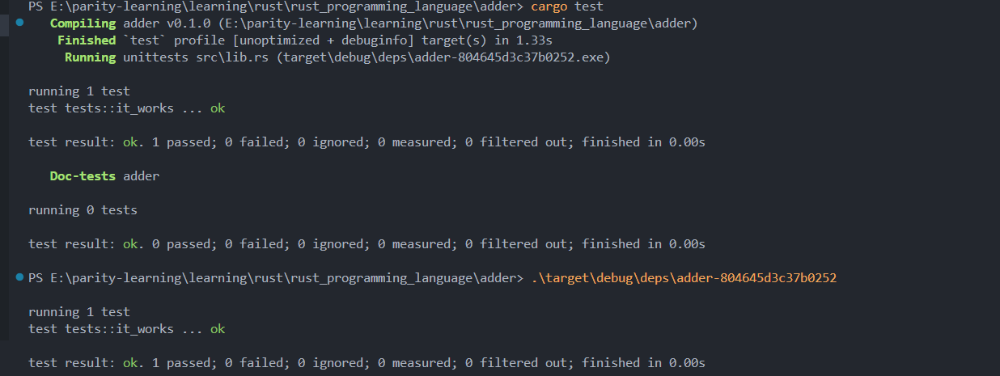
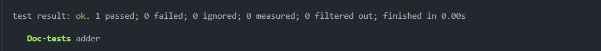
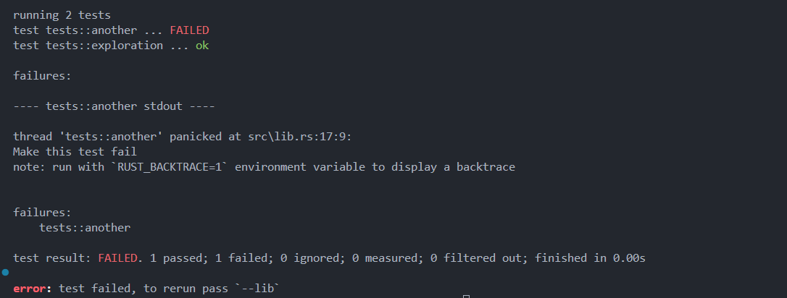
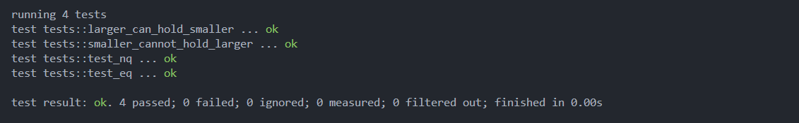

# Rust Testing Guide

## How to Write and Run Tests

### What is Testing

In Rust, a test is a function that verifies whether non-test code functions as expected.

Test function bodies typically perform 3 operations:

1. **Arrange** the required data and state
2. **Act** by running the code being tested
3. **Assert** the results

### Anatomy of Test Functions

Test functions need to be annotated with the `test` attribute:

- **Attribute** is metadata for a piece of Rust code. It doesn't change the logic of the code it decorates, only provides decoration or annotation
- Adding `#[test]` on the line above a function turns it into a test function

### Creating a Test Project

Create a library project called `adder` with the following command:

```bash
cargo new adder --lib
```

Opening the `lib.rs` file, you can see there's a `tests` module and test function:

```rust
pub fn add(left: u64, right: u64) -> u64 {
    left + right
}

#[cfg(test)]
mod tests {
    use super::*;

    #[test]
    fn it_works() {
        let result = add(2, 2);
        assert_eq!(result, 4);
    }
}
```



**Note:** `it_works()` is a test function because it's decorated with the `#[test]` attribute, not because it's located in a `tests` module. The `tests` module can also contain regular non-test functions.

## Running Tests

Use the `cargo test` command to run all test functions:

- Rust builds a Test Runner executable file
- It runs functions annotated with `test` and reports whether they run successfully
- When creating a library project with cargo, it generates a test module with a test function
- You can add any number of test modules or functions to a project

### Test Execution Process

The test execution order is:

1. **Compilation phase**: `Compiling adder`
2. **Compilation complete**: `Finished`, also prints compilation time
3. **Running tests**: `Running`, executes the generated `adder-***.exe` located in the `target\debug\deps\` folder



### Understanding Test Results

When running `cargo test`, the output includes the following information:



The metrics mean:

- **1 passed**: 1 test passed
- **0 failed**: 0 tests failed
- **0 ignored**: 0 tests were ignored (tests can be marked to be ignored and skipped during execution)
- **0 measured**: indicates 0 performance tests
- **0 filtered out**: indicates no tests were filtered out

**Doc-tests adder**: This is the result of documentation tests. Rust can compile code that appears in API documentation, ensuring documentation always stays synchronized with actual code.

## Test Failures

When a test function triggers a `panic`, it indicates test failure.

- Each test runs in an independent thread
- The main thread monitors these threads; when it sees a thread crash, that test is marked as failed

### Intentionally Failing Test Example

```rust
#[test]
fn another() {
    panic!("Make this test fail")
}
```

When running code containing failing tests, the output looks like this:



Failure information includes:

- Which specific test failed
- The reason for failure (panic message)
- Location of failure (file and line number)
- Option to use `RUST_BACKTRACE=1` environment variable to display detailed stack trace

## Advanced Testing Techniques

### 1. Custom Error Messages

You can provide custom error messages in assertions to make test failures more informative:

```rust
pub fn greeting(name: &str) -> String {
    format!("Hello!")
}

#[cfg(test)]
mod tests {
    use super::*;
    #[test]
    fn greetings_contain_name() {
        let result = greeting("Carol");
        assert!(
            result.contains("Carol"),
            "Greeting didn't contain name, value was '{}'",
            result
        );
    }
}
```


**Key Point**: The custom error message helps identify exactly what went wrong when the test fails.

### 2. Testing Functions that Return Results

Tests can return `Result<(), E>` to handle errors gracefully:

```rust
#[cfg(test)]
mod tests {
    #[test]
    fn it_works() -> Result<(), String> {
        if 2 + 3 == 6 {
            Ok(())
        } else {
            Err(String::from("two plus two does not equal four"))
        }
    }
}
```


**Benefits**:

- Cleaner error handling in tests
- More descriptive error messages
- Can use `?` operator for error propagation

### 3. Testing Panic Conditions with `should_panic`

Use `#[should_panic]` to test that code panics under specific conditions:

```rust
pub struct Guess {
    value: u32,
}

impl Guess {
    pub fn new(value: u32) -> Guess {
        if value < 1 {
            panic!(
                "Guess value must be greater than or equal to 1, got {}.",
                value
            )
        } else if value > 100 {
            panic!(
                "Guess value must be less than or equal to 100, got {}.",
                value
            )
        }

        Guess { value }
    }
}

#[cfg(test)]
mod tests {
    use super::*;

    #[test]
    #[should_panic(expected = "Guess value must be less than or equal to 100")]
    fn greater_than_100() {
        Guess::new(200); // This should panic with the expected message
    }
}
```

#### Important Notes about `should_panic`:

- **Test passes** when the code panics with the expected message:
  
  

- **Test fails** when wrong panic message occurs:
  
  

- **Test fails** when no panic occurs:
  
  

**Best Practices**:

- Always use `expected` parameter to specify exact panic message
- Make panic messages specific to avoid false positives
- Test different panic conditions separately

## Assert Macros and Integration Tests

Rust provides several assertion macros for different testing scenarios:

### Common Assert Macros

- **`assert!`**: Checks if a condition is true
- **`assert_eq!`**: Checks if two values are equal
- **`assert_ne!`**: Checks if two values are not equal

### Integration Test Example

Here's a complete example in `tests/test_assert.rs`:

```rust
#[derive(Debug)]
pub struct Rectangle {
    length: u32,
    width: u32,
}

impl Rectangle {
    pub fn can_hold(&self, other: &Rectangle) -> bool {
        self.length > other.length && self.width > other.width
    }
}

#[cfg(test)]
mod tests {
    use super::*; // Import all contents of the external module

    #[test]
    fn larger_can_hold_smaller() {
        let larger = Rectangle {
            length: 8,
            width: 7,
        };

        let smaller = Rectangle {
            length: 5,
            width: 1,
        };
        assert!(larger.can_hold(&smaller));
    }

    #[test]
    fn smaller_cannot_hold_larger() {
        let larger = Rectangle {
            length: 8,
            width: 7,
        };

        let smaller = Rectangle {
            length: 5,
            width: 1,
        };

        assert!(!smaller.can_hold(&larger));
    }

    pub fn add_two(a: i32) -> i32 {
        a + 2
    }

    #[test]
    fn test_eq() {
        assert_eq!(5, add_two(3));
    }

    #[test]
    fn test_nq() {
        assert_ne!(5, add_two(2));
    }
}
```

### Running Integration Tests

Integration tests are placed in the `tests/` directory and run with:

```bash
# Run all tests (unit tests + integration tests)
cargo test

# Run only the specific integration test file
cargo test --test test_assert

# Run specific test function
cargo test larger_can_hold_smaller
```



### Key Points About Assert Macros

1. **`assert!(condition)`**: Panics if condition is false
2. **`assert_eq!(left, right)`**: Panics if values are not equal, provides detailed error message
3. **`assert_ne!(left, right)`**: Panics if values are equal
4. **`use super::*`**: Imports all items from the parent module into the test module

The `#[derive(Debug)]` annotation on `Rectangle` allows the struct to be printed in assertion failure messages, making debugging easier.

## Test Organization and Best Practices

### Project Structure

Based on the provided project structure:

```
rust_programming_language/
├── adder/
│   ├── src/
│   │   └── lib.rs
│   └── tests/
│       ├── custom_error_messages.rs
│       ├── return_Result.rs
│       ├── should_panic.rs
│       └── test_assert.rs
├── Cargo.lock
├── Cargo.toml
└── test_inRust.md
```

### Running Specific Tests

```bash
# Run all tests
cargo test

# Run specific test file
cargo test --test custom_error_messages

# Run specific test function
cargo test greetings_contain_name

# Run tests with specific name pattern
cargo test should_panic
```

## Summary

Rust's testing system provides powerful and comprehensive testing functionality:

1. **Basic Testing**: Use `#[test]` attribute to mark test functions
2. **Test Execution**: Use `cargo test` to run all tests with detailed output
3. **Error Handling**: Tests can return `Result<(), E>` for better error handling
4. **Panic Testing**: Use `#[should_panic]` with `expected` parameter for testing panic conditions
5. **Custom Messages**: Provide meaningful error messages in assertions
6. **Multiple Assertions**: Use `assert!`, `assert_eq!`, and `assert_ne!` for different validation needs
7. **Test Organization**: Support both unit tests (in `src/`) and integration tests (in `tests/`)
8. **Detailed Feedback**: Comprehensive test results with failure analysis

### Key Testing Principles

- **Test Independence**: Each test runs in its own thread
- **Clear Messaging**: Use descriptive test names and custom error messages
- **Comprehensive Coverage**: Test both success and failure conditions
- **Documentation**: Tests serve as living documentation of expected behavior

Writing and running tests ensures code correctness and reliability, which is one of the best practices in Rust development.
