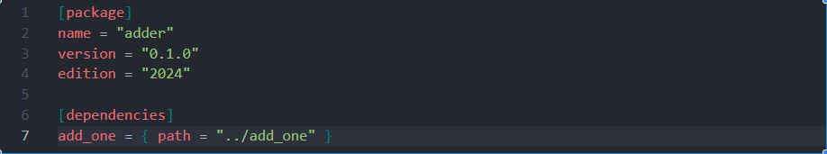
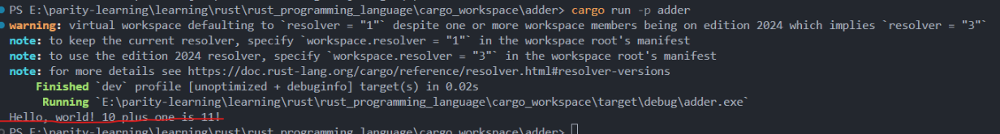

# Cargo Workspace Guide

**Author:** Peile Wu  
**Contact:** peile.wu.1990@gmail.com  
**Date:** September 26, 2025

## Introduction

Cargo workspaces are a powerful feature that helps manage multiple interconnected crates that need to be developed together. A workspace is a set of packages that share the same `Cargo.lock` file and output directory, enabling efficient collaborative development of related Rust projects.

## What is a Cargo Workspace?

A Cargo workspace is a collection of one or more packages that:

- Share a common `Cargo.lock` file
- Share the same output directory (`target/`)
- Can depend on each other
- Are built and managed together

This approach is particularly useful when you have multiple crates that are closely related and need to be developed in tandem.

## Creating a Workspace

### Project Structure

Let's create a workspace with one binary crate and one library crate:

```
cargo_workspace/
├── Cargo.toml          # Workspace configuration
├── Cargo.lock          # Shared lock file
├── target/             # Shared build output
├── adder/              # Binary crate
│   ├── src/
│   │   └── main.rs
│   └── Cargo.toml
└── add_one/            # Library crate
    ├── src/
    │   └── lib.rs
    └── Cargo.toml
```

### Step 1: Create the Workspace Root

First, create a directory named `cargo_workspace/`:

```bash
mkdir cargo_workspace
cd cargo_workspace
```

Create a `Cargo.toml` file in the root directory to configure the entire workspace:

```toml
[workspace]
members = [
    "adder",
    "add_one",
]
```

**Important Notes:**

- This root `Cargo.toml` contains neither `[package]` section nor metadata
- It uses the `[workspace]` section to define workspace members
- Each member is specified by its relative path

### Step 2: Create the Binary Crate

Create the binary crate using Cargo:

```bash
cargo new adder
```

This creates the `adder` directory with a binary crate that contains a `main` function.

### Step 3: Create the Library Crate

Create the library crate:

```bash
cargo new add_one --lib
```

This creates the `add_one` directory with a library crate.

### Step 4: Build the Workspace

Run the build command from the workspace root:

```bash
cargo build
```

This generates:

- A `target/` directory for all compilation artifacts
- A `Cargo.lock` file shared by all workspace members

## Key Benefits of Shared Target Directory

Cargo centralizes the `target` directory because:

1. **Avoid Redundant Compilation**: Workspace crates often depend on each other. Without a shared target, each crate would need to recompile its dependencies repeatedly.

2. **Efficient Build Process**: By sharing the target directory, different crates can reuse compiled artifacts, avoiding unnecessary duplicate compilation.

3. **Consistent Dependencies**: All crates in the workspace use the same versions of dependencies as specified in the shared `Cargo.lock`.

## Setting Up Dependencies Between Crates

### Library Crate (add_one)

The `add_one/src/lib.rs` file contains:

```rust
pub fn add_one(x: i32) -> i32 {
    x + 1
}
```

### Binary Crate Configuration

To make the `adder` binary crate depend on the `add_one` library crate, modify `adder/Cargo.toml`:

```toml
[package]
name = "adder"
version = "0.1.0"
edition = "2024"

[dependencies]
add_one = { path = "../add_one" }
```



**Important**: You must explicitly specify the dependency relationship between crates, even within the same workspace.

### Using the Library in the Binary Crate

Modify `adder/src/main.rs` to use the `add_one` function:

```rust
use add_one;

fn main() {
    let num = 10;
    println!(
        "Hello, world! {} plus one is {}!",
        num,
        add_one::add_one(num)
    );
}
```

## Running Workspace Members

To run a specific crate within the workspace, use the `-p` flag:

```bash
cargo run -p adder
```



The execution shows:

- Compilation of the workspace with resolver warnings (related to edition 2024)
- Successful build and execution of the `adder` binary
- Output: `Hello, world! 10 plus one is 11!`

## Workspace Commands

### Building

- `cargo build`: Build all workspace members
- `cargo build -p <package>`: Build a specific package

### Running

- `cargo run -p <package>`: Run a specific binary package

### Testing

- `cargo test`: Run tests for all workspace members
- `cargo test -p <package>`: Run tests for a specific package

## Best Practices

1. **Clear Dependencies**: Always explicitly declare dependencies between workspace members in their respective `Cargo.toml` files.

2. **Consistent Versioning**: Use the shared `Cargo.lock` to ensure all crates use compatible dependency versions.

3. **Logical Organization**: Group related crates that benefit from shared development and dependencies.

4. **Documentation**: Keep workspace documentation up to date, especially dependency relationships.

## Conclusion

Cargo workspaces provide an elegant solution for managing multiple related Rust crates. By sharing build artifacts and dependency resolution, workspaces make it easier to develop, test, and maintain complex Rust projects with multiple interconnected components.

The key advantages include:

- Reduced compilation time through shared artifacts
- Consistent dependency management
- Simplified project organization
- Streamlined development workflow

This approach is particularly valuable for large projects, libraries with multiple components, or applications that can be logically split into separate crates while maintaining tight integration.
