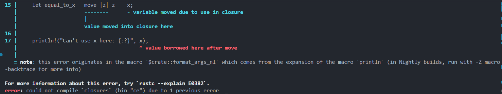

# Rust Closures Introduction

**Author:** Peile Wu  
**Contact:** peile.wu.1990@gmail.com  
**Date:** September 23, 2025

## Overview

Closures are one of Rust's functional programming features that significantly influence the language design. This document introduces closures through practical examples and demonstrates their usage in real code, including advanced patterns like memoization using generic parameters and Fn traits.

## What are Closures?

Closures are **anonymous functions that can capture values from their surrounding environment**. They represent a key functional programming concept in Rust.

## Key Characteristics of Closures

### 1. Anonymous Functions

- Closures are functions without explicit names
- They can be stored in variables for later execution

### 2. Flexible Usage Patterns

- **Pass as parameters** to other functions
- **Return as values** from other functions
- **Assign to variables** for deferred execution

### 3. Environment Capture

- Can **capture values** from their defining scope
- Enable **cross-context execution** - create in one place, call in another
- Maintain access to captured variables even after original scope ends

## Functional Programming Impact on Rust

Rust's functional programming features include:

1. **Functions as first-class citizens** - can be passed as parameters
2. **Higher-order functions** - functions that return other functions
3. **Variable assignment** - storing functions in variables for later execution

## Storing Closures with Generic Parameters and Fn Traits

### Creating a Struct that Holds Closures and Caches Results

One powerful pattern is creating a structure that holds a closure and caches its execution result. This implements:

- **Lazy evaluation**: Only executes the closure when needed (first call)
- **Memoization**: Caches the result for future use
- **Performance optimization**: Expensive calculations run only once

### The Challenge: How to Let Struct Hold Closures

When defining a struct, we need to know all field types, but closures present unique challenges:

- Each closure instance has its own **unique anonymous type**
- Even closures with identical signatures have different types
- Solution: Use **generic parameters** and **trait bounds**

### Fn Traits Overview

The standard library provides Fn traits that all closures implement at least one of:

- **`Fn`**: Can be called multiple times without mutating captured values
- **`FnMut`**: Can be called multiple times and may mutate captured values
- **`FnOnce`**: Can be called only once, may consume captured values

### Cacher Implementation Example

```rust
struct Cacher<T>
where
    T: Fn(u32) -> u32,
{
    calculation: T,        // The closure to cache
    value: Option<u32>,    // Cached result (None before first execution)
}

impl<T> Cacher<T>
where
    T: Fn(u32) -> u32,
{
    fn new(calculation: T) -> Cacher<T> {
        Cacher {
            calculation,
            value: None,
        }
    }

    fn value(&mut self, arg: u32) -> u32 {
        match self.value {
            Some(v) => v,     // Return cached value if available
            None => {
                // Execute closure, cache and return result
                let v = (self.calculation)(arg);
                self.value = Some(v);
                v
            }
        }
    }
}
```

### How the Caching Works

1. **Initial State**: `value` field is `None` before any execution
2. **First Call**: Execute the closure, store result in `value` field as `Some(result)`
3. **Subsequent Calls**: Return cached value directly without re-executing closure
4. **Performance Benefit**: Expensive calculation runs only once regardless of how many times `value()` is called

## Practical Example: Workout Generator with Caching

### Updated Implementation

```rust
fn generate_workout(intensity: u32, random_number: u32) {
    // Create a caching closure that only runs expensive calculation once
    let mut expensive_closure = Cacher::new(|num| {
        println!("calculating slowly ...");
        thread::sleep(Duration::from_secs(2));
        num
    });

    if intensity < 25 {
        println!(
            "Today, do {} pushups!",
            expensive_closure.value(intensity)  // First call: executes closure
        );

        println!(
            "Next, do {} situps!",
            expensive_closure.value(intensity)   // Second call: uses cached result
        );
    } else {
        if random_number == 3 {
            println!("Take a break today! Remember to stay hydrated!");
        } else {
            println!(
                "Today, run for {} minutes!",
                expensive_closure.value(intensity)
            );
        }
    }
}
```

### Execution Output


The program execution demonstrates the caching behavior - notice that "calculating slowly ..." appears only once even though the closure result is used multiple times.

### Key Improvements Over Basic Closure

| Aspect              | Basic Closure                   | Cached Closure                       |
| ------------------- | ------------------------------- | ------------------------------------ |
| **Execution Count** | Runs every time it's called     | Runs only on first call              |
| **Performance**     | Repeated expensive calculations | One-time calculation, cached results |
| **Memory Usage**    | No state storage                | Minimal state for caching            |
| **Use Case**        | Simple, cheap operations        | Expensive, deterministic operations  |

## Cacher Implementation Limitations

### Current Limitations

1. **Single Parameter Assumption**: The current `Cacher` assumes the same input will always produce the same output
2. **Type Constraints**: Only accepts `u32` parameter and returns `u32` value

### Potential Improvements

#### 1. Multiple Parameter Support with HashMap

Instead of caching a single value, use a HashMap to cache results for different inputs:

```rust
use std::collections::HashMap;

struct Cacher<T>
where
    T: Fn(u32) -> u32,
{
    calculation: T,
    values: HashMap<u32, u32>,  // key: input arg, value: result
}

impl<T> Cacher<T>
where
    T: Fn(u32) -> u32,
{
    fn value(&mut self, arg: u32) -> u32 {
        match self.values.get(&arg) {
            Some(&result) => result,
            None => {
                let result = (self.calculation)(arg);
                self.values.insert(arg, result);
                result
            }
        }
    }
}
```

#### 2. Generic Type Parameters for Flexibility

Support different parameter and return types using multiple generic parameters:

```rust
struct Cacher<T, P, R>
where
    T: Fn(P) -> R,
    P: Copy + Eq + std::hash::Hash,
    R: Copy,
{
    calculation: T,
    values: HashMap<P, R>,
}
```

This allows closures like:

- `|x: String| -> usize { x.len() }`
- `|x: f64| -> f64 { x * x }`
- `|x: &str| -> String { x.to_uppercase() }`

## Closure Type Inference

### Key Differences from Functions

Unlike functions defined with `fn`, closures do **not require explicit type annotations** for parameters and return values. This design difference exists because:

- **Functions** are part of explicit public interfaces exposed to users, helping establish consensus on parameter and return value types
- **Closures** are stored in variables and used in narrow contexts without being exposed to library users
- **Compiler inference** works well for closures due to their typically short and contextual nature

### Manual Type Annotations (Optional)

You can still manually add type annotations when needed:

```rust
let expensive_closure = |num: u32| -> u32 {
    println!("calculating slowly ...");
    thread::sleep(Duration::from_secs(2));
    num
};
```

### Function vs Closure Syntax Comparison

**Function Definition:**

```rust
fn add_one_v1(x: u32) -> u32 { x + 1 }  // Explicit parameter and return types
```

**Closure Variations:**

```rust
let add_one_v2 = |x: u32| -> u32 { x + 1 };  // Explicit parameter and return types
let add_one_v3 = |x| { x + 1 };              // Inferred parameter and return types
let add_one_v4 = |x| x + 1;                  // Single expression, braces can be omitted
```

### Type Inference Behavior

**Important**: Closures eventually infer **only one specific type** for parameters and return values:

```rust
fn main() {
    let example_closure = |x| x;  // Error: cannot infer concrete type before use

    // let s = example_closure(String::from("hello"));  // First use determines type as String
    // let n = example_closure(5);  // Error: type mismatch - expected String, found integer
}
```

Once a closure is used with a specific type, the compiler locks in that type for all future uses.

## Closure vs Regular Functions

| Aspect           | Regular Function                          | Closure                       |
| ---------------- | ----------------------------------------- | ----------------------------- |
| **Name**         | Named (`simulated_expensive_calculation`) | Anonymous                     |
| **Definition**   | `fn name() {}`                            | `\|params\| {}`               |
| **Scope Access** | Limited to parameters                     | Can capture environment       |
| **Storage**      | Cannot be stored in variables directly    | Can be assigned to variables  |
| **Caching**      | Manual implementation required            | Easy integration with structs |

## Advanced Patterns and Use Cases

### 1. Memoization Pattern

Perfect for expensive calculations that may be called multiple times with the same inputs.

### 2. Lazy Evaluation

Defer computation until actually needed, improving performance for conditional code paths.

### 3. Configuration Closures

Store configuration logic that can be applied consistently across different contexts.

### 4. Event Handlers

Cache callback functions that respond to events without re-creating handler logic.

## Benefits of Cached Closures

1. **Performance Optimization**: Expensive operations execute only once
2. **Memory Efficiency**: Store results rather than recompute
3. **Code Reusability**: Same caching pattern works across different closure types
4. **Maintainability**: Centralized caching logic in reusable struct
5. **Type Safety**: Compile-time guarantees through generic constraints

# Part I: Basic Closure Concepts and Caching

## Conclusion of Part I

The first part covered fundamental closure concepts and advanced caching patterns. Key takeaways:

- **Anonymous function definition** for inline logic
- **Variable storage** for reusable function objects
- **Caching capabilities** through struct-based memoization
- **Type flexibility** via generic parameters and trait bounds
- **Performance benefits** from lazy evaluation patterns

---

# Part II: Environment Capture and Ownership

## Closures Can Capture Their Environment

One of the most powerful features of closures is their ability to **capture values from their surrounding environment**, which regular functions cannot do.

### Environment Capture vs Regular Functions

```rust
fn main() {
    let x = 4;

    // ✅ Closure can capture variable x from surrounding scope
    let equal_to_x = |z| z == x;

    /* ❌ Regular function cannot capture external variables
    fn equal_to_x(z: i32) -> bool {
        z == x  // Error: can't capture dynamic environment
    }
    */

    let y = 4;
    assert!(equal_to_x(y));
}
```

### Compiler Suggestion for Environment Capture

When you try to capture environment variables in regular functions, Rust suggests using closures:


The compiler error `E0434: can't capture dynamic environment in fn item` clearly indicates that regular functions cannot access external variables, and suggests using closure syntax `|| { ... }` instead.

### Memory Overhead of Environment Capture

**Important consideration**: Closures that capture environment variables incur **memory overhead** for storing captured values.

In most cases, we don't want to capture the environment to avoid this additional overhead. However, when environment capture is needed, closures provide the necessary functionality.

## Three Ways Closures Capture Environment Values

Closures capture values using the same three ownership patterns as function parameters:

### 1. Taking Ownership: `FnOnce`

- **Trait**: `FnOnce`
- **Behavior**: Closure consumes captured variables from the defining scope
- **Usage**: Variables are moved into the closure and cannot be used afterward
- **Calling**: Can only be called once (hence "Once")

### 2. Mutable Borrowing: `FnMut`

- **Trait**: `FnMut`
- **Behavior**: Closure mutably borrows values from environment
- **Usage**: Can modify captured variables
- **Calling**: Can be called multiple times

### 3. Immutable Borrowing: `Fn`

- **Trait**: `Fn`
- **Behavior**: Closure immutably borrows values from environment
- **Usage**: Can read but not modify captured variables
- **Calling**: Can be called multiple times without restrictions

## Automatic Trait Implementation

Rust automatically determines which trait a closure implements based on how it uses captured values:

### Implementation Hierarchy

```
FnOnce ← FnMut ← Fn
  ↑       ↑      ↑
 All   Most    Some
```

- **All closures implement `FnOnce`** (every closure can be called at least once)
- **Closures that don't move captured variables implement `FnMut`**
- **Closures that don't need mutable access implement `Fn`**

### Trait Relationship

The traits have a hierarchical relationship:

- Closures implementing `Fn` also implement `FnMut`
- Closures implementing `FnMut` also implement `FnOnce`
- This allows flexible usage in different contexts

## The `move` Keyword

### Forcing Ownership Transfer

Use the `move` keyword before parameter list to force the closure to take ownership of captured values:

```rust
fn main() {
    let x = vec![1, 2, 3];

    // move keyword forces ownership transfer
    let equal_to_x = move |z| z == x;

    // ❌ Error: x has been moved into closure
    println!("Can't use x here: {:?}", x);

    let y = vec![1, 2, 3];
    assert!(equal_to_x(y));
}
```

### Compilation Error with `move`



After using `move`, the variable `x` is moved into the closure, making it unavailable for use outside the closure. This results in a "value borrowed here after move" error.

### When to Use `move`

The `move` keyword is most useful when:

1. **Passing closures to new threads** - ensures data ownership transfers to the new thread
2. **Ensuring data lives as long as the closure** - prevents dangling references
3. **Explicit ownership control** - when you want to be clear about ownership transfer

### Example: Thread Usage

```rust
use std::thread;

fn main() {
    let data = vec![1, 2, 3];

    // move ensures data is owned by the new thread
    let handle = thread::spawn(move || {
        println!("Data in thread: {:?}", data);
    });

    handle.join().unwrap();
    // data is no longer accessible here
}
```

## Closure Environment Capture Examples

### Example 1: Immutable Borrowing (`Fn`)

```rust
fn main() {
    let x = 4;
    let equal_to_x = |z| z == x;  // Implements Fn

    println!("x is still available: {}", x);  // ✅ Works
    assert!(equal_to_x(4));  // Can call multiple times
    assert!(equal_to_x(4));  // ✅ Still works
}
```

### Example 2: Mutable Borrowing (`FnMut`)

```rust
fn main() {
    let mut x = 0;
    let mut increment = || {  // Implements FnMut
        x += 1;
        x
    };

    println!("First call: {}", increment());   // Output: 1
    println!("Second call: {}", increment());  // Output: 2
    println!("x is: {}", x);                   // Output: 2
}
```

### Example 3: Taking Ownership (`FnOnce`)

```rust
fn main() {
    let x = vec![1, 2, 3];
    let consume_x = || {  // Implements FnOnce
        drop(x);  // Takes ownership and drops x
    };

    consume_x();  // Can only call once
    // consume_x();  // ❌ Error: closure has been moved
}
```

## Best Practices for Fn Trait Bounds

### Recommended Approach

**Start with `Fn`**: When specifying trait bounds for closure parameters, begin with the most restrictive trait (`Fn`):

```rust
fn call_closure<F>(closure: F)
where
    F: Fn()  // Start with Fn
{
    closure();
    closure();  // Can call multiple times
}
```

### Compiler-Guided Refinement

If your closure needs more capabilities, the compiler will guide you:

1. **Start with `Fn`** - most restrictive, allows multiple calls without mutation
2. **Compiler suggests `FnMut`** - if closure needs to mutate captured values
3. **Compiler suggests `FnOnce`** - if closure consumes captured values

### Progressive Example

```rust
// 1. Start with Fn
fn process_data<F>(mut f: F)
where
    F: Fn() -> i32  // Compiler may suggest FnMut if needed
{
    let result1 = f();
    let result2 = f();  // Multiple calls require Fn or FnMut
}

// 2. If mutation needed, use FnMut
fn process_data_mut<F>(mut f: F)
where
    F: FnMut() -> i32  // Allows mutation
{
    let result1 = f();
    let result2 = f();
}

// 3. If consumption needed, use FnOnce
fn process_data_once<F>(f: F)
where
    F: FnOnce() -> i32  // Single use only
{
    let result = f();  // Can only call once
}
```

## Environment Capture vs Performance Trade-offs

| Capture Type                 | Memory Overhead            | Performance | Use Case                     |
| ---------------------------- | -------------------------- | ----------- | ---------------------------- |
| **No Capture**               | None                       | Fastest     | Pure calculations            |
| **Immutable Borrow (`Fn`)**  | Reference only             | Fast        | Read-only access             |
| **Mutable Borrow (`FnMut`)** | Reference + mut capability | Moderate    | Stateful operations          |
| **Move (`FnOnce`)**          | Full ownership             | Variable    | Thread transfer, consumption |

## Part II Summary

Environment capture is a powerful feature that distinguishes closures from regular functions:

- **Environment Access**: Closures can capture surrounding scope variables
- **Memory Trade-offs**: Environment capture incurs memory overhead
- **Ownership Patterns**: Three capture modes mirror function parameter patterns
- **Automatic Inference**: Rust determines appropriate trait based on usage
- **Move Keyword**: Forces ownership transfer for thread safety and explicit control
- **Best Practice**: Start with `Fn` and let compiler guide refinements

---

# Overall Conclusion

Closures provide a powerful way to write more functional and flexible Rust code. The evolution from basic closures to cached implementations and environment capture demonstrates Rust's power in combining functional programming concepts with systems-level performance optimizations.

## Complete Feature Set

- **Basic anonymous functions** for inline logic
- **Caching capabilities** through struct-based memoization
- **Environment capture** for accessing surrounding scope
- **Ownership control** through Fn trait hierarchy
- **Thread safety** with move semantics
- **Type flexibility** via generic parameters and trait bounds
- **Performance benefits** from lazy evaluation patterns

This makes closures not just syntactic conveniences, but fundamental tools for building efficient, maintainable applications that can handle complex ownership scenarios while maintaining performance.
