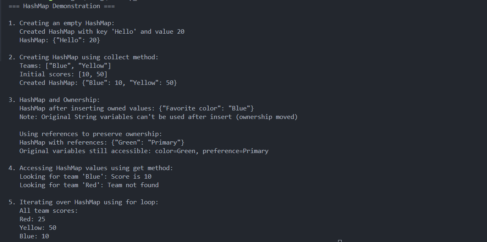
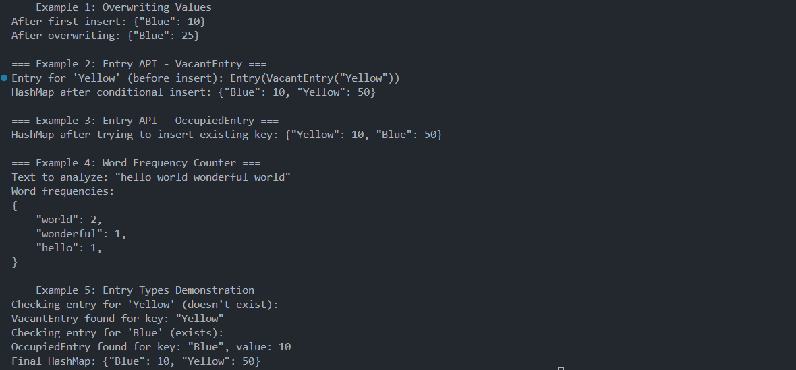

# HashMap Introduction in Rust

**Author:** Peile Wu  
**Email:** peile.wu.1990@gmail.com  
**Date:** September 9, 2025

## Table of Contents

1. [Overview](#overview)
2. [HashMap Characteristics](#hashmap-characteristics)
3. [Creating HashMap](#creating-hashmap)
4. [Ownership and HashMap](#ownership-and-hashmap)
5. [Accessing Values](#accessing-values)
6. [Iterating Over HashMap](#iterating-over-hashmap)
7. [Updating HashMap Values](#updating-hashmap-values)
8. [Entry API for Conditional Operations](#entry-api-for-conditional-operations)
9. [Practical Applications](#practical-applications)
10. [Key Takeaways](#key-takeaways)
11. [Code Examples and Results](#code-examples-and-results)

## Overview

HashMap is a collection type in Rust that stores data in key-value pairs. It uses a hash function to determine how keys and values are stored in memory, making it efficient for lookups by key rather than by index.

## HashMap Characteristics

- **Key-Value Storage**: Stores data as key-value pairs where each key maps to exactly one value
- **Hash Function**: Uses hashing to determine memory placement of keys and values
- **Heap Storage**: Data is stored on the heap rather than the stack
- **Homogeneous**: All keys must be of the same type, and all values must be of the same type
- **Not in Prelude**: Must be explicitly imported with `use std::collections::HashMap;`
- **Limited Standard Library Support**: No built-in macros for HashMap creation
- **Unordered**: No guarantee on iteration order - may vary between program runs

## Creating HashMap

### Method 1: Using `HashMap::new()`

```rust
use std::collections::HashMap;

let mut scores: HashMap<String, i32> = HashMap::new();
scores.insert(String::from("Hello"), 20);
```

**Note**: Type annotation is required when creating an empty HashMap, or the compiler needs to infer types from usage.

### Method 2: Using `collect()` Method

```rust
let teams = vec![String::from("Blue"), String::from("Yellow")];
let initial_scores = vec![10, 50];

let team_scores: HashMap<_, _> = teams.iter()
    .zip(initial_scores.iter())
    .collect();
```

**Process Breakdown**:

1. `iter()` creates immutable reference iterators for both vectors (`std::slice::Iter<'_, T>`)
2. `zip()` pairs elements from both iterators into tuples - length determined by shorter iterator
3. `collect()` consumes the iterator and builds the HashMap from (K, V) tuples

**Execution Flow**:

- `teams.iter()` → produces iterator of `["Blue", "Yellow"]` references
- `initial_scores.iter()` → produces iterator of `[10, 50]` references
- `zip()` → produces iterator of `[("Blue", 10), ("Yellow", 50)]` tuples
- `collect()` → builds `HashMap<&str, i32>` containing the mappings

## Ownership and HashMap

HashMap handles ownership differently depending on the data type:

### For Copy Types (e.g., i32)

Values are copied into the HashMap, original variables remain accessible.

### For Owned Types (e.g., String)

```rust
let field_name = String::from("Favorite color");
let field_value = String::from("Blue");

let mut map = HashMap::new();
map.insert(field_name, field_value);
// field_name and field_value are no longer accessible - ownership moved
```

### Using References to Preserve Ownership

```rust
let color = String::from("Green");
let preference = String::from("Primary");
let mut ref_map = HashMap::new();
ref_map.insert(&color, &preference);
// color and preference remain accessible
println!("Original variables still accessible: color={}, preference={}", color, preference);
```

**Important**: When using references, the referenced values must remain valid for the HashMap's lifetime.

## Accessing Values

Use the `get()` method to retrieve values safely:

```rust
let team_name = String::from("Blue");
let score = scores.get(&team_name);

match score {
    Some(s) => println!("Score is {}", s),
    None => println!("Team not found"),
}
```

**Key Points**:

- `get()` takes a reference to the key as parameter
- Returns `Option<&Value>` - either `Some(&value)` or `None`
- Requires proper error handling for missing keys
- Safe alternative to direct indexing (which would panic on missing keys)

## Iterating Over HashMap

```rust
for (key, value) in &scores {
    println!("{}: {}", key, value);
}
```

**Note**: The iteration order is not guaranteed and may vary between runs due to the hash function implementation.

## Updating HashMap Values

HashMap provides several patterns for updating values:

### 1. Overwriting Existing Values

```rust
let mut scores = HashMap::new();
scores.insert(String::from("Blue"), 10);
scores.insert(String::from("Blue"), 25); // Overwrites previous value
// Result: {"Blue": 25}
```

When you insert a key that already exists, the old value is replaced with the new value.

### 2. Conditional Insertion

For cases where you only want to insert if the key doesn't already exist, use the Entry API.

## Entry API for Conditional Operations

The Entry API provides powerful methods for conditional HashMap operations:

### Basic `or_insert()` Usage

```rust
scores.entry(String::from("Yellow")).or_insert(50);
```

This inserts the value `50` for key `"Yellow"` only if `"Yellow"` doesn't already exist in the HashMap.

### Entry Types

The `entry()` method returns an `Entry` enum with two variants:

#### VacantEntry

When the key doesn't exist in the HashMap:

```rust
match scores.entry(String::from("Yellow")) {
    std::collections::hash_map::Entry::Vacant(e) => {
        println!("VacantEntry found for key: {:?}", e.key());
        e.insert(50);
    }
    // ... other cases
}
```

#### OccupiedEntry

When the key already exists in the HashMap:

```rust
match scores.entry(String::from("Blue")) {
    std::collections::hash_map::Entry::Occupied(e) => {
        println!("OccupiedEntry found for key: {:?}, value: {:?}",
                 e.key(), e.get());
    }
    // ... other cases
}
```

### Updating Based on Existing Values

```rust
let count = map.entry(word).or_insert(0);
*count += 1;
```

This pattern:

1. Gets a mutable reference to the value for `word`
2. If `word` doesn't exist, inserts `0` and returns a reference to it
3. Increments the value through the mutable reference

## Practical Applications

### Word Frequency Counter

A common use case for HashMap with Entry API:

```rust
let text = "hello world wonderful world";
let mut map = HashMap::new();

for word in text.split_whitespace() {
    let count = map.entry(word).or_insert(0);
    *count += 1;
}
// Result: {"hello": 1, "world": 2, "wonderful": 1}
```

**Process Explanation**:

1. Split text into words using `split_whitespace()`
2. For each word, use `entry()` to get an Entry
3. `or_insert(0)` returns a mutable reference to the value (inserting 0 if new)
4. Dereference and increment the count

## Key Takeaways

1. **When to Use HashMap**: Perfect for scenarios where you need to find data by key rather than by index
2. **Type Safety**: Rust's type system ensures all keys are the same type and all values are the same type
3. **Ownership Awareness**: Be mindful of ownership transfer when inserting owned values
4. **Error Handling**: Always handle the `Option` returned by `get()` method
5. **Performance**: O(1) average case for insertions and lookups due to hashing
6. **Entry API**: Use `entry()` and `or_insert()` for conditional operations and value updates
7. **No Ordering Guarantee**: HashMap iteration order is not deterministic
8. **Memory Efficiency**: Only allocates space for actual key-value pairs

## Code Examples and Results

### Basic HashMap Operations


_Screenshot showing the execution results of basic HashMap operations including creation, ownership handling, accessing values, and iteration_

The first example demonstrates:

- Creating empty HashMap with type annotations
- Using `collect()` method with `zip()` for HashMap creation
- Ownership transfer vs reference usage
- Safe value access with `get()` method
- HashMap iteration patterns

### Advanced HashMap Operations


_Screenshot showing the execution results of advanced HashMap operations including value overwriting, Entry API usage, and word frequency counting_

The second example covers:

- Value overwriting behavior
- Entry API with VacantEntry and OccupiedEntry
- Conditional insertion patterns
- Word frequency counter implementation
- Entry type demonstrations

### Complete Working Example

```rust
use std::collections::HashMap;

fn main() {
    println!("=== HashMap Comprehensive Demo ===\n");

    // 1. Creating and populating HashMap
    let mut scores = HashMap::new();
    scores.insert(String::from("Blue"), 10);
    scores.insert(String::from("Yellow"), 50);
    scores.insert(String::from("Red"), 25);

    // 2. Accessing values safely
    let team_name = String::from("Blue");
    if let Some(score) = scores.get(&team_name) {
        println!("Team {} has score: {}", team_name, score);
    }

    // 3. Using Entry API for updates
    scores.entry(String::from("Green")).or_insert(30);

    // 4. Conditional value modification
    let blue_score = scores.entry(String::from("Blue")).or_insert(0);
    *blue_score += 5; // Increment existing value

    // 5. Iterating over all entries
    println!("Final scores:");
    for (team, score) in &scores {
        println!("  {}: {}", team, score);
    }

    // 6. Word frequency example
    let text = "rust is great rust is powerful";
    let mut word_count = HashMap::new();

    for word in text.split_whitespace() {
        let count = word_count.entry(word).or_insert(0);
        *count += 1;
    }

    println!("\nWord frequencies: {:?}", word_count);
}
```

### Sample Output Pattern

```
=== HashMap Comprehensive Demo ===

Team Blue has score: 10

Final scores:
  Red: 25
  Yellow: 50
  Green: 30
  Blue: 15

Word frequencies: {"rust": 2, "is": 2, "great": 1, "powerful": 1}
```

This comprehensive introduction covers both fundamental and advanced HashMap concepts in Rust, providing theoretical understanding alongside practical examples for effective usage in real-world applications.
