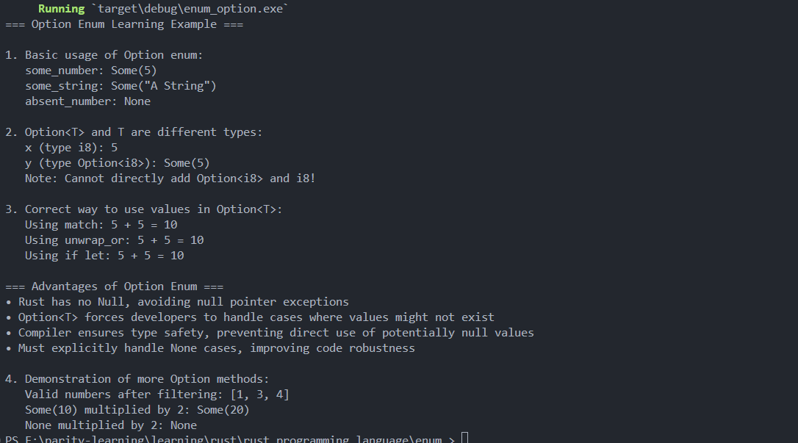

# Rust Enums Introduction

**Author:** Peile Wu  
**Email:** peile.wu.1990@gmail.com  
**Date:** September 3, 2025

## Overview

This project demonstrates the basic usage of enums in Rust, showcasing different ways to define and use enumeration types for IP address handling, and introduces the powerful Option enum from Rust's standard library.

## What are Enums?

Enums (enumerations) in Rust allow you to define a type by enumerating its possible variants. They are particularly powerful because each variant can hold different types and amounts of data.

## Part 1: Basic Enum Usage

### Basic Enum Definition

```rust
enum IpAddrKind {
    V4,
    V6,
}
```

### Using Enums with Structs

```rust
struct IpAddr {
    kind: IpAddrKind,
    address: String,
}

let home = IpAddr {
    kind: IpAddrKind::V4,
    address: String::from("127.0.0.1"),
};
```

### Enums with Associated Data

Rust enums can store data directly in their variants, eliminating the need for separate structs:

```rust
enum IpAddr {
    V4(String),      // String data
    V6(String),
}

// Or with different data types:
enum IpAddr {
    V4(u8, u8, u8, u8),  // Four u8 values
    V6(String),          // String data
}
```

### Advanced Usage

Enums can even hold complex types like structs:

```rust
enum IpAddr {
    V4(Ipv4Addr),
    V6(Ipv6Addr),
}
```

## Enum Methods

Just like structs, enums can have methods defined using `impl` blocks:

```rust
enum Message {
    Quit,                       // No associated data
    Move { x: i32, y: i32 },   // Anonymous struct
    Write(String),             // String data
    ChangeColor(i32, i32, i32), // Tuple data
}

impl Message {
    fn call(&self) {
        // Method implementation
    }
}

// Usage
let m = Message::Move { x: 12, y: 24 };
m.call(); // Call method on enum instance
```

### Enum Variant Types

Enums support multiple data association patterns:

- **Unit variants**: `Quit` - No associated data
- **Struct variants**: `Move { x: i32, y: i32 }` - Named fields
- **Tuple variants**: `Write(String)`, `ChangeColor(i32, i32, i32)` - Unnamed fields

## Part 2: The Option Enum

### What is Option<T>?

The Option enum is one of the most important enums in Rust's standard library. It's defined in the Prelude module, making it available everywhere without explicit imports. Option represents a value that might exist (Some) or might not exist (None).

```rust
enum Option<T> {
    Some(T),
    None,
}
```

### Why Option instead of Null?

**The Problem with Null in Other Languages:**

- Null represents "no value"
- Variables can be in two states: null or non-null
- Major issue: Trying to use a null value as if it were non-null causes errors
- The concept is useful, but the implementation is problematic

**Rust's Solution:**

- Rust has **no null values**
- Option<T> provides the same concept but with **type safety**
- You **cannot** use Option<T> directly as T
- **Compiler enforces** proper handling of potentially absent values

### Basic Option Usage

```rust
fn main() {
    // Compiler infers T is i32
    let some_number = Some(5);

    // Compiler infers T is string slice
    let some_string = Some("A String");

    // Explicit type annotation needed for None
    let absent_number: Option<i32> = None;
}
```

### Type Safety Demonstration

Option<T> and T are **different types** - you cannot mix them directly:

```rust
let x: i8 = 5;
let y: Option<i8> = Some(5);

// This will cause a compilation error:
// let sum = x + y;  // error[E0277]: cannot add 'Option<i8>' to 'i8'
```

### Handling Option Values

There are several ways to safely extract values from Option<T>:

#### Method 1: Using match

```rust
match y {
    Some(value) => {
        let sum = x + value;
        println!("Sum: {}", sum);
    }
    None => {
        println!("No value to calculate with");
    }
}
```

#### Method 2: Using unwrap_or

```rust
let sum = x + y.unwrap_or(0);  // Use 0 if y is None
```

#### Method 3: Using if let (Syntax Sugar)

```rust
if let Some(value) = y {
    let sum = x + value;
    println!("Sum: {}", sum);
}
```

### Advanced Option Methods

#### Working with Collections of Options

```rust
let numbers = vec![Some(1), None, Some(3), Some(4), None];

// Filter out None values and extract Some values
let valid_numbers: Vec<i32> = numbers
    .into_iter()
    .filter_map(|x| x)
    .collect();
// Result: [1, 3, 4]
```

#### Using map with Options

```rust
let opt_value: Option<i32> = Some(10);
let doubled = opt_value.map(|x| x * 2);  // Some(20)

let none_value: Option<i32> = None;
let doubled_none = none_value.map(|x| x * 2);  // None
```

### Practical Example and Output

Here's a complete example showing Option usage:



The output demonstrates:

1. **Basic Usage**: Creating Some and None values
2. **Type Safety**: Option<T> and T are different types
3. **Safe Value Extraction**: Three different approaches (match, unwrap_or, if let)
4. **Advanced Operations**: Using filter_map and map methods

As shown in the screenshot, the program successfully:

- Creates various Option values with type inference
- Demonstrates type safety by preventing direct arithmetic between Option<i8> and i8
- Shows three equivalent ways to safely extract and use Option values
- Filters a collection of Options to get only valid values
- Applies transformations using the map method

## Key Advantages of Enums

1. **Type Safety**: Enums ensure you can only use valid variants
2. **Data Association**: Each variant can carry different types of data
3. **Memory Efficiency**: Rust stores enum variants efficiently
4. **Pattern Matching**: Works seamlessly with `match` statements
5. **Null Safety**: Option eliminates null pointer exceptions
6. **Explicit Handling**: Forces developers to handle all possible cases

## Running the Code

### Basic Enum Example

```bash
rustc enum_define.rs
./enum_define
```

### Option Enum Example

```bash
rustc enum_option.rs
./enum_option
```

## Learn More

This introduction covers basic enum usage, methods, and the powerful Option type. The Option enum is fundamental to Rust programming and provides a safe alternative to null values found in other languages.

Key takeaways:

- Always handle both Some and None cases when working with Option
- Use pattern matching (`match`) for comprehensive case handling
- Use `if let` for simple cases where you only care about Some values
- Use methods like `unwrap_or`, `map`, and `filter_map` for functional-style programming
- Remember that Option<T> and T are completely different types

Explore Rust's pattern matching with `match` statements and other enum methods to unlock the full power of Rust's type system!
