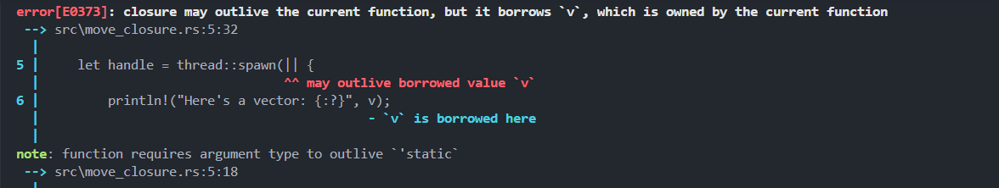
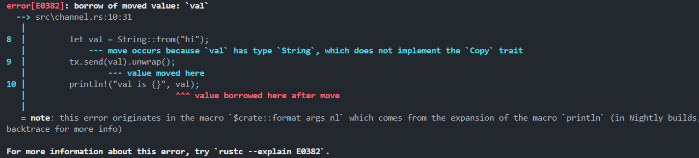

# Rust Multi-Threading: Fearless Concurrency

**Author:** Peile Wu  
**Contact:** peile.wu.1990@gmail.com  
**Date:** October 2, 2025

---

## Core Concepts

### Concurrency vs Parallelism

- **Concurrent**: Different parts execute independently
- **Parallel**: Different parts run simultaneously

Rust's **Fearless Concurrency** enables bug-free concurrent code that's easy to refactor.

### Threading Challenges

- **Race conditions**: Inconsistent data access order
- **Deadlocks**: Threads waiting for each other's resources
- **Non-deterministic bugs**: Hard to reproduce and fix

### Rust's Threading Model

Rust standard library provides **1:1 model** (OS-level threads) for minimal runtime overhead.

---

## Creating and Managing Threads

### Basic Thread Creation

```rust
use std::thread;
use std::time::Duration;

fn main() {
    thread::spawn(|| {
        for i in 1..10 {
            println!("hi number {} from the spawned thread!", i);
            thread::sleep(Duration::from_millis(1));
        }
    });

    for i in 1..5 {
        println!("hi number {} from the main thread!", i);
        thread::sleep(Duration::from_millis(1));
    }
    // Spawned thread stops when main thread ends
}
```

### Using JoinHandle

`JoinHandle` ensures threads complete before program exits:

```rust
let handle = thread::spawn(|| {
    for i in 1..10 {
        println!("hi number {} from the spawned thread!", i);
        thread::sleep(Duration::from_millis(1));
    }
});

for i in 1..5 {
    println!("hi number {} from the main thread!", i);
    thread::sleep(Duration::from_millis(1));
}

handle.join().unwrap(); // Blocks until spawned thread completes
```

---

## Move Closures

### The Problem

Without `move`, closures borrow variables, but spawned threads may outlive those variables:

```rust
let v = vec![1, 2, 3];
let handle = thread::spawn(|| {
    println!("Here's a vector: {:?}", v); // ERROR: v might be dropped
});
```

### The Solution

Use `move` to transfer ownership:

```rust
let v = vec![1, 2, 3];
let handle = thread::spawn(move || {
    println!("Here's a vector: {:?}", v); // OK: ownership transferred
});
handle.join().unwrap();
```

---

## Execution Results

### Success with `move`


Program executes successfully, printing: `Here's a vector: [1, 2, 3]`

### Error without `move`



**Compiler Error:**

```
error[E0373]: closure may outlive the current function, but it borrows `v`
  --> src\move_closure.rs:5:32
   |
5  |     let handle = thread::spawn(|| {
   |                                ^^ may outlive borrowed value `v`
```

**Explanation:** The closure borrows `v` but the spawned thread requires `'static` lifetime. Using `move` transfers ownership, satisfying the lifetime requirement.

---

## Key Takeaways

1. **Ownership rules** prevent data races at compile time
2. **JoinHandle** ensures thread completion
3. **Move closures** transfer ownership for thread safety
4. Rust catches concurrency bugs before runtime

The compiler's strict checks enable safe, concurrent programming without runtime overhead.

---

## Message Passing with Channels

### Philosophy

Go language motto: **"Don't communicate by sharing memory; share memory by communicating"**

Rust achieves safe concurrency through **message passing** - threads (or actors) communicate by sending data to each other.

### Channel Basics

**Channel** consists of two parts:

- **Sender (Transmitter)**: Sends data
- **Receiver**: Checks and receives incoming data

A channel "closes" when either the sender or receiver is dropped.

### Creating Channels

Use `mpsc::channel` to create a channel:

- **mpsc** = Multiple Producer, Single Consumer
- Returns a tuple: `(sender, receiver)`

```rust
use std::sync::mpsc;
use std::thread;

fn main() {
    let (tx, rx) = mpsc::channel();

    thread::spawn(move || {
        let val = String::from("hi");
        tx.send(val).unwrap();
    });

    let received = rx.recv().unwrap();
    println!("Got: {}", received);
}
```

### Sender Methods

**`send()`** method:

- Parameter: Data to send
- Returns: `Result<T, E>`
- Returns error if receiver has been dropped

### Receiver Methods

**`recv()`** method:

- Blocks current thread until a value arrives
- Returns `Result<T, E>` when value received
- Returns error when sender is closed

**`try_recv()`** method:

- Non-blocking
- Immediately returns `Result<T, E>`:
  - `Ok` with data if available
  - `Err` if no data
- Typically used in a loop to check for messages

### Ownership Transfer in Channels

Ownership plays a crucial role in message passing, ensuring safe concurrent code:

```rust
thread::spawn(move || {
    let val = String::from("hi");
    tx.send(val).unwrap();
    println!("val is {}", val); // ERROR: val moved
});
```



**Error:** After `send(val)`, ownership is transferred to the channel. Attempting to use `val` afterwards causes a compilation error. This prevents data races by ensuring only one thread can access the data at a time.

### Sending Multiple Values

```rust
use std::sync::mpsc;
use std::thread;
use std::time::Duration;

fn main() {
    let (tx, rx) = mpsc::channel();

    thread::spawn(move || {
        let vals = vec![
            String::from("hi"),
            String::from("from"),
            String::from("the"),
            String::from("thread"),
        ];

        for val in vals {
            tx.send(val).unwrap();
            thread::sleep(Duration::from_millis(200));
        }
    });

    for received in rx {
        println!("Got: {}", received);
    }
}
```

The receiver can iterate over the channel, blocking until each message arrives.

### Multiple Producers

Create multiple senders by cloning:

```rust
use std::sync::mpsc;
use std::thread;
use std::time::Duration;

fn main() {
    let (tx, rx) = mpsc::channel();
    let tx1 = mpsc::Sender::clone(&tx);

    thread::spawn(move || {
        let vals = vec![
            String::from("hi"),
            String::from("from"),
            String::from("the"),
            String::from("thread"),
        ];

        for val in vals {
            tx1.send(val).unwrap();
            thread::sleep(Duration::from_millis(200));
        }
    });

    thread::spawn(move || {
        let vals = vec![
            String::from("1: hi"),
            String::from("1: from"),
            String::from("1: the"),
            String::from("1: thread"),
        ];

        for val in vals {
            tx.send(val).unwrap();
            thread::sleep(Duration::from_millis(200));
        }
    });

    for received in rx {
        println!("Got: {}", received);
    }
}
```


**Result:** Messages from both senders are interleaved as they arrive. The receiver processes all messages from multiple producers through a single channel, demonstrating the "multiple producer, single consumer" pattern.
