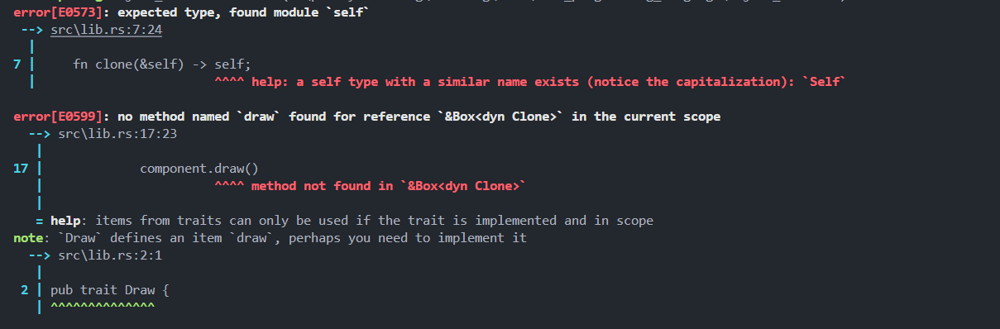

# Object-Oriented Programming Features in Rust

**Author:** Peile Wu  
**Contact:** peile.wu.1990@gmail.com  
**Date:** October 8, 2025

## Introduction

Rust is influenced by multiple programming paradigms, including object-oriented programming (OOP). Object-oriented programming typically includes the following characteristics:

- Named objects
- Encapsulation
- Inheritance

## Objects Contain Data and Behavior

- Object-oriented programs are composed of objects
- Objects encapsulate data and the procedures that operate on that data
- These procedures are typically called methods or operations

### Is Rust Object-Oriented?

Based on this definition, **Rust can be considered object-oriented**:

- `struct` and `enum` contain data
- `impl` blocks provide methods for them
- However, `struct` and `enum` with methods are not explicitly called "objects" in Rust

## Encapsulation

**Encapsulation** means that code outside an object cannot directly access the object's internal implementation details. The only way to interact with an object is through its publicly exposed API.

### Encapsulation in Rust

Rust uses the `pub` keyword to determine which modules, types, functions, and methods are public.

**Example:**

```rust
pub struct AverageCollection {
    list: Vec<i32>,
    average: f64,
}

impl AveragedCollection {
    pub fn add(&mut self, value: i32) {
        self.list.push(value);
        self.update_average();
    }

    pub fn remove(&mut self) -> Option<i32> {
        let result = self.list.pop();
        match result {
            Some(value) => {
                self.update_average();
                Some(value)
            },
            None => None,
        }
    }

    pub fn average(&self) -> f64 {
        self.average
    }

    fn update_average(&mut self) {
        let total: i32 = self.list.iter().sum();
        self.average = total as f64 / self.list.len() as f64;
    }
}
```

In this example:

- The `list` and `average` fields are private
- Public methods (`add`, `remove`, `average`) provide controlled access
- The private `update_average` method encapsulates internal logic

## Inheritance

**Inheritance** allows objects to inherit data and behavior from another object without redefining the related code.

### Rust Does Not Have Inheritance

**However, Rust does not support traditional inheritance.**

### Why Use Inheritance?

There are two main reasons for using inheritance:

#### 1. Code Reuse

- **In Rust:** Default trait methods enable code sharing

#### 2. Polymorphism

- Allowing subtypes to be used where a parent type is expected
- **In Rust:** Generics and trait bounds provide polymorphism (bounded parametric polymorphism)

### Modern Perspective

Many modern programming languages no longer use inheritance as a built-in design pattern. Rust follows this trend by providing alternative mechanisms like traits and composition instead of classical inheritance.

---

## Using Trait Objects to Store Different Types of Values

### The GUI Tool Example

Consider a requirement to create a GUI tool that:

- Iterates through a list of elements
- Calls each element's `draw` method to render it
- Examples: Button, TextField, etc.

#### Object-Oriented Approach

In traditional OOP languages:

1. Define a `Component` parent class with a `draw` method
2. Define `Button`, `TextField`, etc., inheriting from `Component`

#### Rust Approach: Defining a Trait for Common Behavior

Rust avoids calling struct or enum "objects" because they are separate from their `impl` blocks.

**Trait objects** are somewhat similar to objects in other languages:

- They combine data and behavior to some degree
- However, trait objects differ from traditional objects:
  - You cannot add data to trait objects
  - Trait objects are specifically used to abstract common behavior
  - They are not as general-purpose as objects in other languages

### Implementation Example

```rust
// lib.rs
pub trait Draw {
    fn draw(&self);
}

pub struct Screen {
    pub components: Vec<Box<dyn Draw>>,
}

impl Screen {
    pub fn run(&self) {
        for component in self.components.iter() {
            component.draw()
        }
    }
}

pub struct Button {
    pub width: u32,
    pub height: u32,
    pub label: String,
}

impl Draw for Button {
    fn draw(&self) {
        // draw a button
    }
}
```

```rust
// main.rs
use oo::Draw;
use oo::{Button, Screen};

struct SelectBox {
    width: u32,
    height: u32,
    options: Vec<String>,
}

impl Draw for SelectBox {
    fn draw(&self) {}
}

fn main() {
    let screen = Screen {
        components: vec![
            Box::new(SelectBox {
                width: 75,
                height: 10,
                options: vec![
                    String::from("Yes"),
                    String::from("Maybe"),
                    String::from("No"),
                ],
            }),
            Box::new(Button {
                width: 50,
                height: 10,
                label: String::from("OK"),
            }),
        ],
    };

    screen.run();
}
```

## Dynamic Dispatch vs Static Dispatch

### Static Dispatch

When using trait bounds with generics, the Rust compiler performs **monomorphization**:

- The compiler generates non-generic implementations of functions and methods for each concrete type used to replace the generic type parameter
- Code generated through monomorphization performs **static dispatch**
- The specific method to call is determined at compile time

### Dynamic Dispatch

**Dynamic dispatch** means:

- The specific method being called cannot be determined at compile time
- The compiler generates extra code to figure out which method to call at runtime

**When using trait objects, dynamic dispatch occurs:**

- **Runtime overhead:** Additional performance cost at runtime
- **Prevents compiler optimizations:** The compiler cannot inline method code, preventing certain optimizations

### Trade-offs

- **Static dispatch (generics):** Faster runtime, larger binary size due to code duplication
- **Dynamic dispatch (trait objects):** Flexibility to store different types, runtime cost, smaller binary

## Object Safety

### What is Object Safety?

Only traits that are **object-safe** can be made into trait objects.

Rust uses a set of rules to determine whether an object is safe. You only need to remember two key rules:

1. **Method return types must not be `Self`**
2. **Methods must not contain any generic type parameters**

### Example of Object-Unsafe Trait

The `Clone` trait is not object-safe because its `clone` method returns `Self`:

```rust
pub trait Clone {
    fn clone(&self) -> Self;  // Returns Self - not object-safe!
}
```

If you try to use it as a trait object:

```rust
pub struct Screen {
    pub components: Vec<Box<dyn Clone>>,  // Error!
}
```

**This will result in compiler errors:**



The error shows:

- `error[E0573]: expected type, found module 'self'` - The lowercase `self` should be `Self`
- `error[E0599]: no method named 'draw' found for reference '&Box<dyn Clone>'` - The `Clone` trait doesn't have a `draw` method, and mixing trait requirements causes issues

The compiler cannot determine the concrete size of types implementing the trait at compile time, making it impossible to create trait objects from such traits.

---

## Summary

Rust incorporates object-oriented concepts through:

- **Encapsulation** via the `pub` keyword and visibility modifiers
- **Data and behavior** through structs, enums, and impl blocks
- **Polymorphism** through traits and generics rather than inheritance
- **Code reuse** through default trait implementations and composition
- **Trait objects** (`dyn Trait`) for runtime polymorphism via dynamic dispatch
- **Object safety rules** to ensure trait objects can be created safely

While Rust does not support classical inheritance, it provides powerful alternatives that maintain type safety and avoid common pitfalls associated with inheritance hierarchies.
