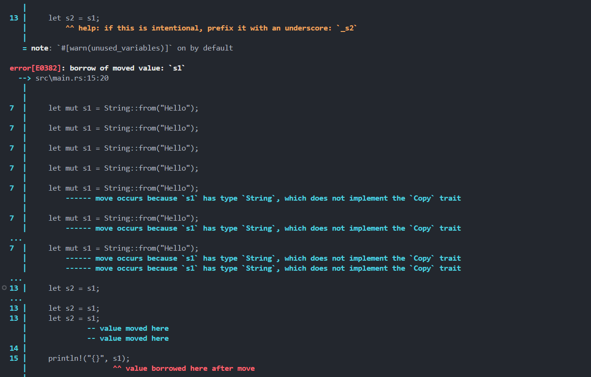
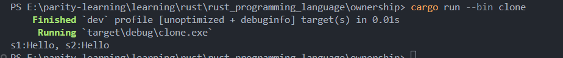
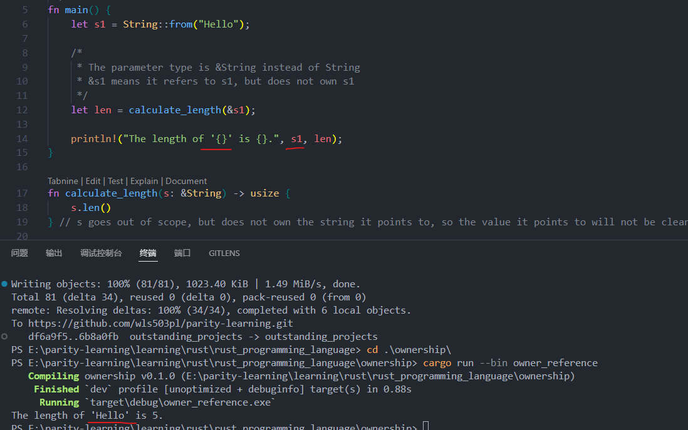
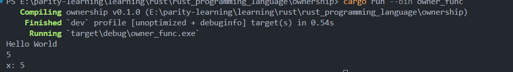

# Cargo: Rust's Build System and Package Manager

## Overview

Cargo is Rust's official build system and package manager that comes automatically installed with Rust. It provides comprehensive project management, dependency management, and build functionality for Rust projects.

## Basic Commands

### Version Check

```bash
cargo --version  # Check Cargo version
```

### Project Creation

```bash
cargo new hello_cargo  # Create a new Cargo project
```

When creating a project, Cargo automatically generates the project structure including:

- `Cargo.toml` - Project configuration file
- `src/main.rs` - Main source code file

### Project Building

```bash
cargo build  # Create executable file
```

This command will:

- Generate executable files in the `target\debug\` directory (`.exe` files on Windows)
- Create a `Cargo.lock` file on first execution to track precise dependency versions

### Code Checking

```bash
cargo check  # Check code compilation without producing executable files
```

This command is much faster than `cargo build` and is perfect for periodic checks during development to ensure code compiles correctly.

### Quick Run

```bash
cargo run  # Build and run the compiled file quickly
```

This command automatically builds the project and runs the generated executable, ideal for development and testing phases.

## Release Build

### Optimized Build

```bash
cargo build --release  # Release version build
```

Release build characteristics:

- Performs code optimization for faster runtime
- Takes longer to compile
- Generates executable files in `target/release` directory instead of `target/debug`

## Rust Ownership System

### Understanding Ownership

Rust's ownership system is one of its most distinctive features, ensuring memory safety without a garbage collector. Understanding ownership is crucial for writing effective Rust code.

#### Basic Ownership Rules

1. Each value in Rust has a variable that's called its owner
2. There can only be one owner at a time
3. When the owner goes out of scope, the value will be dropped

#### String Types and Memory Management

Rust provides two main string types:

- **String literals (`&str`)**: Stored in the program binary, immutable and known at compile time
- **String type (`String`)**: Allocated on the heap, mutable and can store unknown amounts of text at compile time

```rust
// Creating a String from a string literal
let mut s = String::from("Hello");
s.push_str(", World!");  // This is possible because String is mutable
```

#### String Memory Layout

When working with `String` types, understanding the memory layout is crucial:

```
Stack (Variable s1)          Heap (String data)
┌─────────┬─────────┐       ┌─────┬─────┐
│  name   │  value  │       │index│value│
├─────────┼─────────┤   ┌──→├─────┼─────┤
│   ptr   │    ●────┼───┘   │  0  │  h  │
├─────────┼─────────┤       ├─────┼─────┤
│   len   │    5    │       │  1  │  e  │
├─────────┼─────────┤       ├─────┼─────┤
│capacity │    5    │       │  2  │  l  │
└─────────┴─────────┘       ├─────┼─────┤
                            │  3  │  l  │
                            ├─────┼─────┤
                            │  4  │  o  │
                            └─────┴─────┘
```

The `String` structure contains:

- **ptr**: Pointer to heap memory location
- **len**: Current length of the string
- **capacity**: Total allocated space

#### Move Semantics

When assigning heap-allocated data (like `String`) to another variable, Rust performs a "move" rather than a copy:

```rust
let s1 = String::from("Hello");
let s2 = s1;  // s1 is moved to s2
// println!("{}", s1);  // This would cause a compile error!
```



This prevents double-free errors and ensures memory safety.

#### Clone for Deep Copying

To create a deep copy of heap data, use the `clone()` method:

```rust
let s1 = String::from("Hello");
let s2 = s1.clone();  // Creates a deep copy
println!("s1: {}, s2: {}", s1, s2);  // Both are valid
```



### References and Borrowing

#### What are References?

The `&` symbol represents a reference in Rust. References allow you to refer to a value without taking ownership of it. This solves the problem of having to transfer ownership back and forth between functions.

```rust
fn main() {
    let s1 = String::from("Hello");

    // &s1 creates a reference to s1, but doesn't own s1
    let len = calculate_length(&s1);

    println!("The length of '{}' is {}.", s1, len);  // s1 is still valid!
}

fn calculate_length(s: &String) -> usize {
    s.len()
}  // s goes out of scope, but since it doesn't own the string, nothing is dropped
```



#### Borrowing Rules

The act of creating a reference is called **borrowing**. Key characteristics:

- References are **immutable by default**
- You can reference a value without taking ownership
- When the reference goes out of scope, the value it points to is **not** dropped
- No need to return values to give back ownership since you never had it

#### Benefits of References

Using references eliminates the need for complex ownership transfers:

```rust
// Without references - ownership transfer required
fn calculate_length_ownership(s: String) -> (String, usize) {
    let length = s.len();
    (s, length)  // Must return the String to give back ownership
}

// With references - no ownership transfer needed
fn calculate_length(s: &String) -> usize {
    s.len()  // Simple and clean
}
```

### Ownership and Functions

#### Function Parameters

Passing values to functions follows the same ownership rules as variable assignment:

- **Move occurs**: For heap-allocated types like `String`
- **Copy occurs**: For stack-allocated types like integers (`i32`, `i64`, etc.)

```rust
fn main() {
    let s = String::from("Hello World");
    take_ownership(s);  // s is moved into the function
    // println!("{}", s);  // This would error - s is no longer valid

    let x = 5;
    make_copy(x);  // x is copied
    println!("x: {}", x);  // x is still valid
}

fn take_ownership(some_string: String) {
    println!("{}", some_string);
    // some_string goes out of scope and is dropped
}

fn make_copy(some_number: i32) {
    println!("{}", some_number);
    // some_number goes out of scope, but since it's Copy, nothing special happens
}
```



#### Return Values and Ownership Transfer

Functions can transfer ownership through their return values:

```rust
fn gives_ownership() -> String {
    let some_string = String::from("hello");
    some_string  // Ownership is moved to the caller
}

fn takes_and_gives_back(a_string: String) -> String {
    a_string  // Ownership is moved back to the caller
}
```

#### Key Ownership Principles

- **Move pattern**: A value is moved when assigned to another variable
- **Scope-based cleanup**: When a variable containing heap data goes out of scope, its value is cleared by the `Drop` function (unless ownership was transferred)
- **Single ownership**: Each piece of data has exactly one owner at any given time

### Development Tips

When working with ownership in Cargo projects:

1. Use `cargo check` frequently to catch ownership errors early (like error E0382: borrow of moved value)
2. Understand when to use `clone()` vs. references (borrowing) for performance
3. Pay attention to function signatures - they indicate ownership transfer vs borrowing
4. Use `cargo run --bin <name>` to test specific ownership examples
5. Organize learning examples in separate `.rs` files with dedicated binary targets
6. Keep documentation files (`.md`) at the project root for easy reference

### Common Ownership Errors and Solutions

**Move Error Example** (from `move_error.rs`):

```rust
let s1 = String::from("Hello");
let s2 = s1;  // s1 is moved to s2
println!("{}", s1);  // ERROR E0382: borrow of moved value
```

**Solutions**:

- Use `clone()`: `let s2 = s1.clone();`
- Use references: `let s2 = &s1;` (for borrowing without ownership transfer)

**Reference Success Example** (from `owner_reference.rs`):

```rust
let s1 = String::from("Hello");
let len = calculate_length(&s1);  // Borrowing with &s1
println!("The length of '{}' is {}.", s1, len);  // s1 still valid!
```

## Important Files

- **Cargo.toml**: Project configuration file containing project metadata and dependency information
- **Cargo.lock**: Dependency lock file that tracks precise dependency versions (auto-generated, no manual editing needed)

## Development Best Practices

Experienced Rust engineers typically:

1. Periodically run `cargo check` to ensure compilation passes
2. Use `cargo run` for quick testing during development
3. Use `cargo build --release` for optimized builds before release

## Project Structure

For learning Rust ownership concepts, a more comprehensive project structure might look like:

```
ownership/
├── Cargo.toml
├── Cargo.lock
├── README.md
├── ownership_introduction.md
├── img/                     # Image resources
├── src/
│   ├── done.rs                  # Completed ownership examples
│   ├── move_error.rs            # Demonstrates ownership move errors
│   ├── owner_func.rs            # Ownership and function relationships
│   ├── owner_reference.rs       # Ownership and reference relationships
│   └── owner_return.rs          # Ownership and return values
└── target/
    ├── debug/
    └── release/
```

### Working with Multiple Source Files

When your project contains multiple `.rs` files like the ownership examples:

1. **Main entry point**: Usually `src/main.rs` or `src/lib.rs`
2. **Module files**: Additional `.rs` files can be organized as modules
3. **Documentation**: Markdown files for project documentation
4. **Resources**: Supporting files like images in dedicated directories

### Working with Multiple Source Files and Binary Targets

When your project contains multiple `.rs` files for learning ownership concepts, you can configure them as separate binary targets in `Cargo.toml`:

```toml
[[bin]]
name = "move_error"
path = "src/move_error.rs"

[[bin]]
name = "owner_func"
path = "src/owner_func.rs"

[[bin]]
name = "owner_return"
path = "src/owner_return.rs"

[[bin]]
name = "owner_reference"
path = "src/owner_reference.rs"

[[bin]]
name = "clone"
path = "src/clone.rs"
```

To run specific examples:

```bash
# Run individual ownership examples
cargo run --bin owner_func      # Demonstrates function ownership transfer
cargo run --bin owner_return    # Shows return value ownership
cargo run --bin owner_reference # Demonstrates borrowing with references
cargo run --bin clone           # Shows cloning behavior

# Note: move_error.rs intentionally contains compilation errors for demonstration
# cargo run --bin move_error    # This will show compiler error E0382
```

### Cargo Commands for Ownership Development

```bash
cargo check                    # Quick compilation check for ownership errors
cargo run --bin <binary_name>  # Run specific ownership example
cargo build                    # Build all binaries
cargo clean                    # Clean target directory
```

## Conclusion

Cargo makes Rust project management simple and efficient, serving as an indispensable tool in the Rust ecosystem. Its design philosophy of "convention over configuration" provides an out-of-the-box development experience while maintaining flexibility for complex project requirements. Understanding Rust's ownership system alongside Cargo's build tools enables developers to write safe, efficient, and maintainable code.
