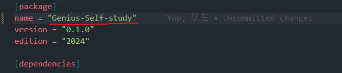
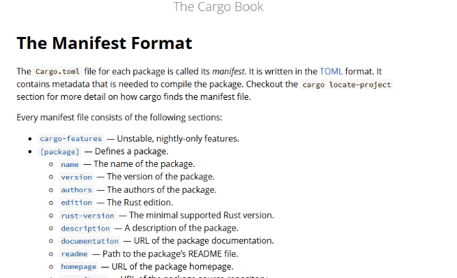
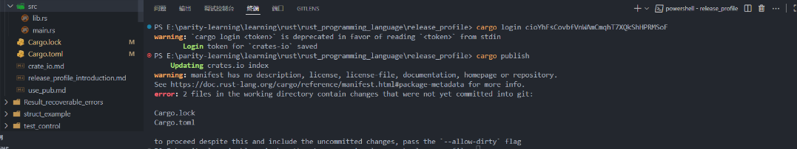
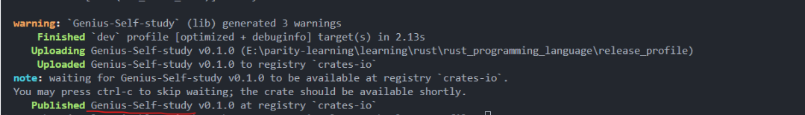
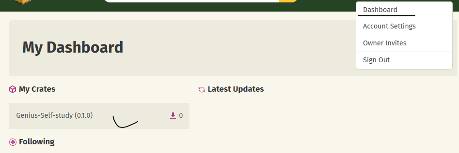
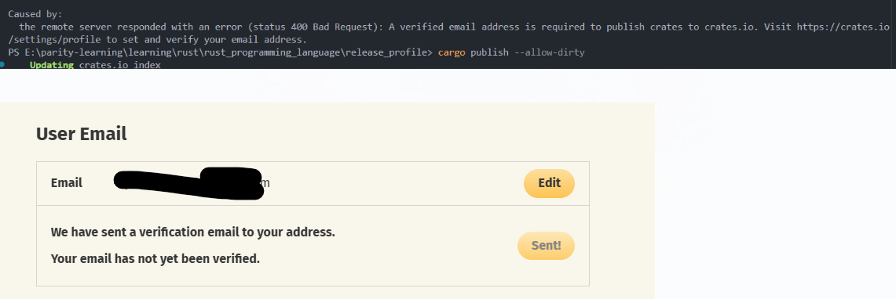

# Publishing Rust Crates to Crates.io: A Complete Guide

**Author:** Peile Wu  
**Contact:** peile.wu.1990@gmail.com  
**Date:** September 26, 2025

## Table of Contents

1. [Overview](#overview)
2. [Setting up Crates.io Account](#setting-up-cratesio-account)
3. [API Token Management](#api-token-management)
4. [Configuring Package Metadata](#configuring-package-metadata)
5. [Publishing Your Crate](#publishing-your-crate)
6. [Version Management](#version-management)
7. [Yanking and Unyanking Versions](#yanking-and-unyanking-versions)
8. [Troubleshooting](#troubleshooting)
9. [Best Practices](#best-practices)

## Overview

This guide demonstrates the complete process of publishing a Rust crate to Crates.io, the official Rust package registry. The example project "Genius-Self-study" serves as a practical demonstration of the publishing workflow, from initial setup to successful deployment.

## Setting up Crates.io Account

### Initial Registration

1. Visit [https://crates.io/](https://crates.io/) - the official Rust community's crate registry


2. Log in using your GitHub account credentials
3. Navigate to **Account Settings** from your profile menu
4. Select the **API Tokens** tab


### Creating Your First API Token

The API token is essential for authenticating your publishing requests:

1. Click the **"New Token"** button
2. Provide a descriptive name for your token (e.g., "rust_beginner")
3. Set appropriate scopes (typically "publish-new" for first-time publishing)
4. Copy the generated token immediately - you won't be able to see it again


**Security Warning:** Keep your API token secure. If compromised, immediately revoke it from your Crates.io account settings.

## API Token Management

### Local Authentication Setup

Configure Cargo to use your API token:

```bash
cargo login [your-api-token]
```

This command stores your token in the local credentials file at `~/.cargo/credentials`.

### Alternative: Environment Variable

For CI/CD systems, use the `CARGO_REGISTRY_TOKEN` environment variable:

```bash
export CARGO_REGISTRY_TOKEN=your-api-token-here
```

## Configuring Package Metadata

### Essential Cargo.toml Configuration

Your `Cargo.toml` file must include specific metadata in the `[package]` section:

```toml
[package]
name = "Genius-Self-study"
authors = ["Peile"]
version = "0.1.0"
edition = "2024"
description = "A Rust Practice"
license = "MIT"

[dependencies]
```



### Required Metadata Fields

- **name**: Must be unique across all crates.io packages
- **version**: Follow [Semantic Versioning](http://semver.org/) guidelines
- **description**: Brief one or two sentence description for search results
- **license**: Use SPDX license identifier (find options at [http://spdx.org/licenses/](http://spdx.org/licenses/))
- **authors**: List of package maintainers
- **edition**: Rust edition (2018, 2021, 2024)

### Package Metadata Reference

For detailed information about all available metadata fields, refer to the official Cargo documentation:



### Optional Metadata

For more comprehensive package information, consider adding:

- **homepage**: Project homepage URL
- **repository**: Source code repository URL
- **documentation**: Documentation URL
- **readme**: Path to README file
- **keywords**: Search keywords (max 5)
- **categories**: Crate categories

Reference the [Cargo Manifest Format documentation](https://doc.rust-lang.org/cargo/reference/manifest.html) for complete metadata options.

## Publishing Your Crate

### Pre-publication Checklist

1. Ensure all required metadata is present in `Cargo.toml`
2. Verify your email address is confirmed on Crates.io
3. Test your crate locally with `cargo test`
4. Check for any uncommitted changes

### Publishing Command

```bash
cargo publish
```



### Handling Uncommitted Changes

If you have uncommitted changes in your Git repository, you can use:

```bash
cargo publish --allow-dirty
```

**Note:** This flag should be used sparingly and only when you understand the implications.

### Successful Publication

Upon successful publication, you'll see output similar to:

```
Updating crates.io index
Uploading Genius-Self-study v0.1.0
Uploaded Genius-Self-study v0.1.0 to registry `crates-io`
```



### Viewing Your Published Crate

After publication, you can view your crate in the Crates.io dashboard:



## Version Management

### Updating Existing Crates

To publish a new version of an existing crate:

1. Modify your code as needed
2. Update the `version` field in `Cargo.toml`
3. Follow semantic versioning principles:
   - **Patch** (0.1.1): Bug fixes
   - **Minor** (0.2.0): New features, backward compatible
   - **Major** (1.0.0): Breaking changes
4. Run `cargo publish` again

### Version Immutability

**Important:** Once published, crate versions are permanent and cannot be:

- Overwritten
- Modified
- Deleted

This ensures that projects depending on specific versions continue to work reliably.

## Yanking and Unyanking Versions

### Understanding Yanking

Yanking a version prevents new projects from using it while allowing existing projects to continue functioning. This is useful for versions with critical bugs or security vulnerabilities.

### Yanking a Version

```bash
cargo yank --vers 1.0.1
```

### Unyanking a Version

```bash
cargo yank --vers 1.0.1 --undo
```

### Effects of Yanking

- **Existing projects**: Continue to work normally with existing `Cargo.lock` files
- **New projects**: Cannot select the yanked version as a dependency
- **No data loss**: Code remains available and downloadable

## Troubleshooting

### Email Verification Required

**Error Message:** "A verified email address is required to publish crates to crates.io"

**Solution:**

1. Visit your Crates.io account settings
2. Verify your email address
3. Check your inbox for verification email
4. Click the verification link
5. Retry publishing



### Uncommitted Changes Error

**Error Message:** Warning about uncommitted changes

**Solutions:**

1. Commit your changes: `git add . && git commit -m "Prepare for release"`
2. Use `--allow-dirty` flag (not recommended for production)

### Name Conflicts

If your desired crate name is taken, consider:

- Adding a prefix or suffix
- Using underscores or hyphens
- Choosing a more descriptive name

## Best Practices

### Security

- Never commit API tokens to version control
- Use environment variables for CI/CD deployments
- Regularly rotate API tokens
- Monitor your published crates for security vulnerabilities

### Documentation

- Include comprehensive README files
- Write clear API documentation
- Provide usage examples
- Document breaking changes in version updates

### Testing

- Implement thorough test coverage
- Test on multiple Rust versions
- Use continuous integration
- Test documentation examples

### Versioning

- Follow semantic versioning strictly
- Document changes in CHANGELOG.md
- Consider API stability guarantees
- Use pre-release versions for experimental features

### Maintenance

- Respond to issues and pull requests promptly
- Keep dependencies updated
- Monitor download statistics and usage
- Consider maintenance status communication

## Project Structure Example

The published crate demonstrates a typical Rust project structure:

```
release_profile/
├── src/
│   ├── lib.rs
│   └── main.rs
├── Cargo.toml
├── Cargo.lock
└── README.md (recommended)
```

## Conclusion

Publishing to Crates.io makes your Rust libraries available to the global Rust community. By following the guidelines in this document and maintaining good practices around versioning, documentation, and security, you can contribute valuable tools and libraries to the Rust ecosystem.

Remember that publishing is just the beginning - maintaining and supporting your crates is an ongoing responsibility that benefits the entire Rust community.

---

_For the most up-to-date information, always refer to the official [Cargo documentation](https://doc.rust-lang.org/cargo/) and [Crates.io documentation](https://doc.crates.io/)._
