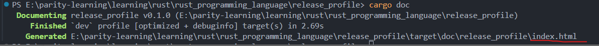
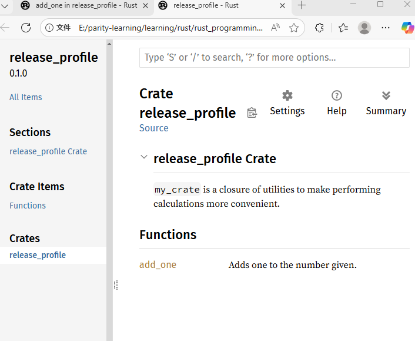
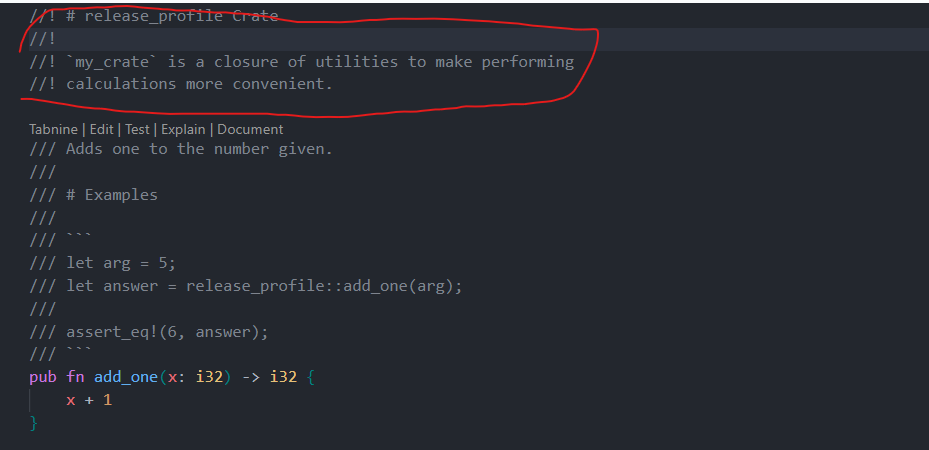
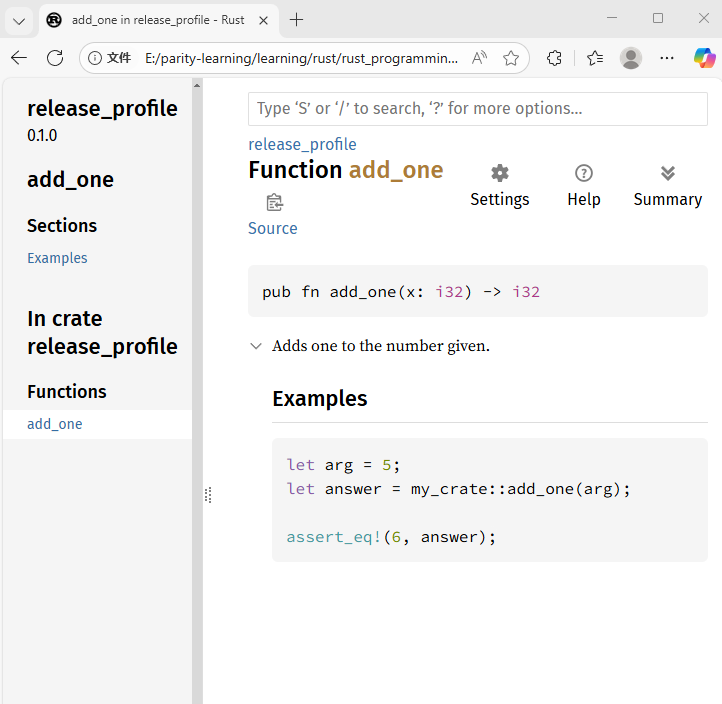

## Publishing and Documentation

### Publishing to crates.io

You can share your code by publishing packages to the crate registry at [https://crates.io/](https://crates.io/). This registry distributes the source code of registered packages and primarily hosts open-source code.

### Documentation Comments

Rust supports documentation comments that generate HTML documentation for your public API. These comments use `///` and support Markdown syntax.

#### Example Documentation Comment

````rust
/// Adds one to the number given.
///
/// # Examples
///
/// ```
/// let arg = 5;
/// let answer = release_profile::add_one(arg);
///
/// assert_eq!(6, answer);
/// ```
pub fn add_one(x: i32) -> i32 {
    x + 1
}
````

#### Common Documentation Sections

- **# Examples**: Provides usage examples
- **# Panics**: Describes scenarios where the function might panic
- **# Errors**: For functions returning `Result`, describes possible error types
- **# Safety**: For unsafe functions, explains safety requirements

### Generating Documentation

You can generate documentation using:

```bash
cargo doc
```

This command:

- Runs the `rustdoc` tool (included with Rust)
- Places generated HTML documentation in the `target/doc` directory
- Creates an `index.html` file for browsing

To build and open documentation:

```bash
cargo doc --open
```

This builds documentation for the current crate and its dependencies, then opens it in your browser.

### Documentation as Tests

Documentation examples serve as tests. When you run `cargo test`, Rust will execute the example code in documentation comments as tests, ensuring your examples stay up-to-date with your code.

### Module-Level Documentation

Use `//!` for documenting entire crates or modules:

```rust
//! # release_profile Crate
//!
//! `my_crate` is a closure of utilities to make performing
//! calculations more convenient.
```

This type of comment is typically placed in:

- `src/lib.rs` (crate root)
- At the beginning of modules to describe the module as a whole

### Documentation Results

The following images show the generated documentation:


_Running cargo doc command_


_Documentation comments displayed in browser_


_Documentation structure and navigation_


_Complete documentation view in browser_

## Conclusion

Release profiles provide powerful customization options for Rust builds. By properly configuring dev and release profiles, developers can optimize their workflow for both development speed and production performance. The examples demonstrated show significant improvements in both compilation time and runtime performance when using appropriate optimization levels.

Combined with Rust's excellent documentation system, you can create well-optimized, well-documented crates that are easy to maintain and share with the community through crates.io.
