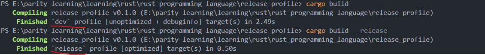

# Release Profile Introduction

**Author:** Peile Wu  
**Contact:** peile.wu.1990@gmail.com  
**Date:** September 25, 2025

## Overview

This document introduces Rust's release profiles and how to customize build configurations for different development scenarios.

## What are Release Profiles?

Release profiles in Rust are predefined and customizable configurations that give you more control over code compilation. Each profile configuration is independent of others, allowing you to optimize builds for specific purposes.

Cargo has two main types of profiles:

1. **Dev Profile**: Used for development with `cargo build`
2. **Release Profile**: Used for production releases with `cargo build --release`

## Project Structure

The current project structure demonstrates a typical Rust project setup with custom profile configurations:

```
release_profile/
├── img/
│   ├── cargo_build_unopt_opt.png
│   └── dev_release_profile.png
├── src/
├── Cargo.lock
└── Cargo.toml
```

## Customizing Profiles

### Default Behavior

Cargo provides default configurations for each profile. To customize a specific profile's configuration, you can add a `[profile.xxx]` section in your `Cargo.toml` file and override a subset of the default settings.

### Optimization Levels

The `opt-level` parameter determines the degree of optimization Rust performs on code during compilation:

- **Range**: 0-3
- **Higher values**: More optimization, longer compilation time
- **Lower values**: Less optimization, faster compilation

### Configuration Examples

Here's our customized `Cargo.toml` configuration:

```toml
[package]
name = "release_profile"
version = "0.1.0"
edition = "2024"

[dependencies]

# The opt-level parameter determines the degree of optimization Rust performs on the code when compiling.
# The value range is 0~3. The higher the optimization level, the more time it takes.
[profile.dev]

# To shorten compilation time during development, set this to 1 so that no additional parameters are added when running cargo build,
# and some optimizations will be made during compilation (but not as much as in release mode).
opt-level = 1

# When releasing the final product, spend more time compiling the program, because it only needs to be compiled once when releasing,
# and this time the compilation must be in-depth to ensure performance.
[profile.release]
opt-level = 3
```

### Dev Profile Configuration

```toml
[profile.dev]
opt-level = 1
```

**Purpose**: Shortens compilation time during development while still providing some optimization. When running `cargo build` without additional parameters, this configuration ensures faster builds with moderate optimization (though not as extensive as release mode).

### Release Profile Configuration

```toml
[profile.release]
opt-level = 3
```

**Purpose**: Maximizes optimization for the final product. Since release builds typically happen only once per deployment, we can afford longer compilation times to ensure optimal performance.

## Build Results Comparison

### Development vs Release Build Performance

The following image shows the comparison between `cargo build` (dev profile) and `cargo build --release` (release profile):



As you can see:

- **Dev build**: Finished in 2.49s with `[unoptimized + debuginfo]` target
- **Release build**: Finished in 0.50s with `[optimized]` target, demonstrating the performance benefits of release optimization

### Optimization Level Impact

The following image demonstrates the difference between builds with and without custom optimization settings:


This comparison shows:

- **Before optimization**: `[unoptimized + debuginfo]` target completed in 0.49s
- **After optimization**: `[optimized + debuginfo]` target completed in 0.37s

The custom `opt-level = 1` setting for the dev profile provides a balance between compilation speed and runtime performance.

## Key Benefits

1. **Development Efficiency**: Faster compilation times during development with `opt-level = 1`
2. **Production Performance**: Maximum optimization for release builds with `opt-level = 3`
3. **Flexibility**: Independent configuration for different build scenarios
4. **Customization**: Ability to fine-tune compilation behavior based on specific needs

## Additional Resources

For complete documentation on default values and all available options for each configuration, refer to: [https://doc.rust-lang.org/cargo/](https://doc.rust-lang.org/cargo/)

## Conclusion

Release profiles provide powerful customization options for Rust builds. By properly configuring dev and release profiles, developers can optimize their workflow for both development speed and production performance. The examples demonstrated show significant improvements in both compilation time and runtime performance when using appropriate optimization levels.
