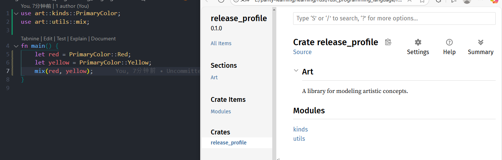
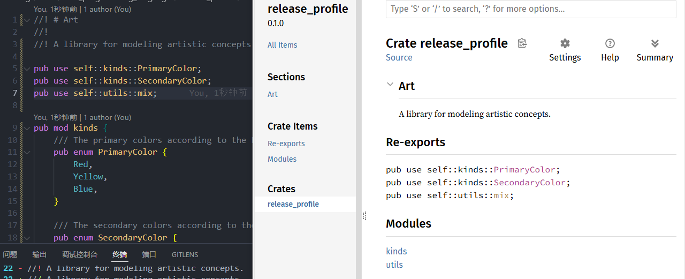

# Using pub use for Convenient Public APIs

**Author:** Peile Wu  
**Contact:** peile.wu.1990@gmail.com  
**Date:** September 25, 2025

## Overview

This document explains how to use `pub use` to create user-friendly public APIs that differ from your internal code structure.

## The Problem

The internal structure of a crate that makes sense for developers during development may not be convenient for users of the crate.

Developers often organize code into multiple layers and deep hierarchies. Users may find it difficult to locate specific types within these deep structures.

### Example of Complex Deep Structure

```rust
// Inconvenient for users
my_crate::some_module::another_module::UsefulType;
```

### User-Friendly Alternative

```rust
// Much more convenient
my_crate::UsefulType;
```

## The Solution

You don't need to reorganize your internal code structure. Instead, use `pub use` to re-export items and create a public structure that differs from your internal private structure.

## Implementation Example

### Before Using pub use

Without `pub use`, users must reference the full module path:

```rust
// main.rs
use art::kinds::PrimaryColor;
use art::utils::mix;

fn main() {
    let red = PrimaryColor::Red;
    let yellow = PrimaryColor::Yellow;
    mix(red, yellow);
}
```


_Documentation structure before using pub use - users must navigate deep module hierarchy_

### After Using pub use

In `lib.rs`, add re-exports at the crate root:

```rust
//! # release_profile
//!
//! A library for modeling artistic concepts.

pub use self::kinds::PrimaryColor;
pub use self::kinds::SecondaryColor;
pub use self::utils::mix;

pub mod kinds {
    /// The primary colors according to the RYB color model.
    pub enum PrimaryColor {
        Red,
        Yellow,
        Blue,
    }

    /// The secondary colors according to the RYB color model.
    pub enum SecondaryColor {
        Orange,
        Green,
        Purple,
    }
}

pub mod utils {
    use crate::kinds::*;

    /// Combines 2 primary color in equal amounts to create a secondary color
    pub fn mix(c1: PrimaryColor, c2: PrimaryColor) -> SecondaryColor {
        SecondaryColor::Green
    }
}
```

Now users can import directly from the crate root:

```rust
// main.rs
// use release_profile::kinds::PrimaryColor;  // Old way
// use release_profile::utils::mix;           // Old way

// The changes inside 'lib.rs' make the following use statements work
use release_profile::mix;
use release_profile::PrimaryColor;

fn main() {
    let red = PrimaryColor::Red;
    let yellow = PrimaryColor::Yellow;
    mix(red, yellow);
}
```


_Documentation structure after using pub use - shows convenient re-exports section_

## Key Benefits

1. **User-Friendly API**: Provides a flatter, more convenient API surface
2. **Internal Structure Preserved**: No need to reorganize internal code
3. **Flexibility**: Can selectively expose only the items you want users to access easily
4. **Documentation**: Re-exports appear clearly in generated documentation
5. **Backward Compatibility**: Both the re-exported path and original path remain valid

## Best Practices

- Use `pub use` to expose the most commonly used items at the crate root
- Keep internal module structure for code organization
- Document re-exports appropriately in your crate-level documentation
- Consider your users' workflow when deciding what to re-export
- Use `self::` prefix for clarity when re-exporting from the same crate

## Conclusion

`pub use` is a powerful tool for creating user-friendly APIs without sacrificing internal code organization. It allows you to maintain a logical internal structure while presenting a clean, convenient interface to your users.
