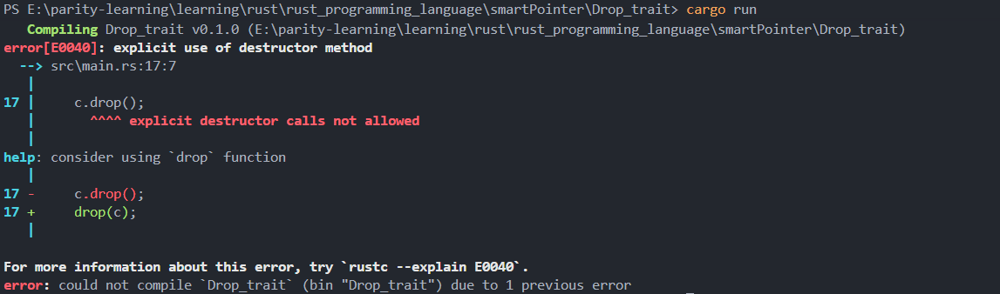

# Drop Trait in Rust

## Overview

The Drop trait allows you to customize what happens when a value is about to go out of scope. This is essential for resource management such as releasing files, network connections, or other system resources.

## Key Concepts

- **Any type can implement the Drop trait**
- **The Drop trait is in the prelude module** (no need to import)
- **Only requires implementing the `drop` method**
- **Takes a mutable reference to `self` as parameter**

## Basic Implementation

```rust
struct CustomSmartPointer {
    data: String,
}

impl Drop for CustomSmartPointer {
    fn drop(&mut self) {
        println!("Dropping CustomSmartPointer with data `{}`!", self.data);
    }
}

fn main() {
    let c = CustomSmartPointer {
        data: String::from("my stuff"),
    };
    let d = CustomSmartPointer {
        data: String::from("other stuff"),
    };
    println!("CustomSmartPointers created.");
}
// Output:
// CustomSmartPointers created.
// Dropping CustomSmartPointer with data `other stuff`!
// Dropping CustomSmartPointer with data `my stuff`!
```

## Manual Drop with `std::mem::drop`

### Why Manual Drop is Sometimes Needed

- Rust's automatic drop functionality cannot be easily disabled (and shouldn't be)
- The Drop trait is designed for automatic cleanup logic
- **Rust does not allow manually calling the Drop trait's `drop` method**

### Attempting Direct Call (❌ This Won't Work)

```rust
let c = CustomSmartPointer {
    data: String::from("my stuff"),
};
c.drop(); // ❌ Error: explicit destructor calls not allowed
```

**Error Message:**



### Using `std::mem::drop` Function (✅ Correct Approach)

```rust
fn main() {
    let c = CustomSmartPointer {
        data: String::from("my stuff"),
    };

    drop(c); // Manually drop 'c' early - safe, won't drop twice

    let d = CustomSmartPointer {
        data: String::from("other stuff"),
    };
    println!("CustomSmartPointers created.");
}
// Output:
// Dropping CustomSmartPointer with data `my stuff`!
// CustomSmartPointers created.
// Dropping CustomSmartPointer with data `other stuff`!
```


## Key Points

1. **Automatic Cleanup**: Drop is called automatically when values go out of scope
2. **LIFO Order**: Variables are dropped in reverse order of creation (Last In, First Out)
3. **No Double Drop**: Using `std::mem::drop` prevents the automatic drop from occurring
4. **Safety**: Rust prevents explicit calls to the `drop` method to avoid double-free errors
5. **Resource Management**: Perfect for managing files, network connections, memory, etc.

## Common Use Cases

- File handle cleanup
- Network connection closure
- Memory deallocation for custom allocators
- Releasing locks or other synchronization primitives
- Logging or debugging when objects are destroyed

## Best Practices

- Implement Drop for types that manage resources
- Use `std::mem::drop` when you need early cleanup
- Don't rely on Drop for critical program logic (use explicit cleanup methods)
- Keep Drop implementations simple and fast
- Avoid panicking in Drop implementations when possible
