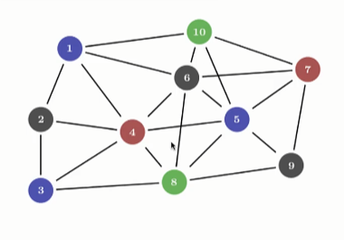
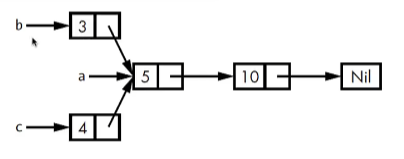

# Rc<T>: Reference Counting Smart Pointer

**Author:** Peile Wu  
**Email:** peile.wu.1990@gmail.com  
**Date:** September 29, 2025

---

## Overview

`Rc<T>` (Reference Counting) is a smart pointer provided by Rust to support multiple ownership scenarios.

### Core Features

- **Reference Counting Mechanism**: Maintains an internal counter to track the number of references to a value
- **Automatic Cleanup**: When the reference count reaches 0, the value is automatically cleaned up without triggering dangling reference issues
- **Reference Tracking**: Tracks all references pointing to the value



## Use Cases

`Rc<T>` is suitable for the following situations:

1. Need to allocate data on the **heap**
2. Data is **read** by multiple parts of the program (read-only access)
3. Cannot determine at compile time which part will finish using the data last

⚠️ **Important Limitation**: `Rc<T>` can only be used in **single-threaded** scenarios

## Basic Usage

### Importing the Module

`Rc<T>` is not in the prelude and must be explicitly imported:

```rust
use std::rc::Rc;
```

### Core Functions

- `Rc::clone(&a)`: Increments the reference count (shallow copy)
- `Rc::strong_count(&a)`: Returns the strong reference count
- `Rc::weak_count(&a)`: Returns the weak reference count

## Example: Sharing List Ownership

### Problem Scenario

Two Lists (b and c) need to share ownership of another List (a):



### Incorrect Example: Using Box<T>

```rust
enum List {
    Cons(i32, Box<List>),
    Nil,
}

use crate::List::{Cons, Nil};

fn main() {
    let a = Cons(5, Box::new(Cons(10, Box::new(Nil))));

    let b = Cons(3, Box::new(a));
    let c = Cons(4, Box::new(a)); // ❌ Error: ownership of a has moved to b
}
```

**Error Message**:

```
error[E0382]: use of moved value: `a`
```

`Box<T>` only supports single ownership. The ownership of `a` has already been moved when creating `b`.

### Correct Example: Using Rc<T>

```rust
enum List {
    Cons(i32, Rc<List>),
    Nil,
}

use crate::List::{Cons, Nil};
use std::rc::Rc;

fn main() {
    // Create a, reference count = 1
    let a = Rc::new(Cons(5, Rc::new(Cons(10, Rc::new(Nil)))));
    println!("Count after creating a = {}", Rc::strong_count(&a));

    // Create b, share a via Rc::clone, reference count = 2
    let b = Cons(3, Rc::clone(&a));
    println!("Count after creating b = {}", Rc::strong_count(&a));

    {
        // Create c, reference count = 3
        let c = Cons(4, Rc::clone(&a));
        println!("Count after creating c = {}", Rc::strong_count(&a));
    }
    // c goes out of scope, reference count = 2

    println!("Count after c goes out of scope = {}", Rc::strong_count(&a));
}
```

**Program Output**:


```
Count after creating a = 1
Count after creating b = 2
Count after creating c = 3
Count after c goes out of scope = 2
```

## Rc::clone() vs Type's clone() Method

| Method          | Behavior                        | Performance              |
| --------------- | ------------------------------- | ------------------------ |
| `Rc::clone(&a)` | Only increments reference count | Efficient (shallow copy) |
| `a.clone()`     | Usually performs deep copy      | Relatively expensive     |

## Important Constraints

### Immutable References

`Rc<T>` allows you to share **read-only data** across different parts of your program through **immutable references**.

### Why Not Allow Mutable References?

If `Rc<T>` allowed multiple mutable references, it would violate Rust's borrowing rules:

> **Borrowing Rule**: Multiple mutable references to the same memory location can lead to data races and data inconsistency

Therefore, `Rc<T>` only supports sharing immutable data. If interior mutability is needed, it can be combined with `RefCell<T>`.

## Summary

- ✅ Use `Rc<T>` to implement multiple ownership
- ✅ Automatic memory management through reference counting
- ✅ Suitable for single-threaded scenarios with read-only shared data
- ❌ Does not support mutable references
- ❌ Cannot be used in multi-threaded contexts (use `Arc<T>` for multi-threading)

---

**Contact Information:**  
For questions or feedback, please contact Peile Wu at peile.wu.1990@gmail.com
