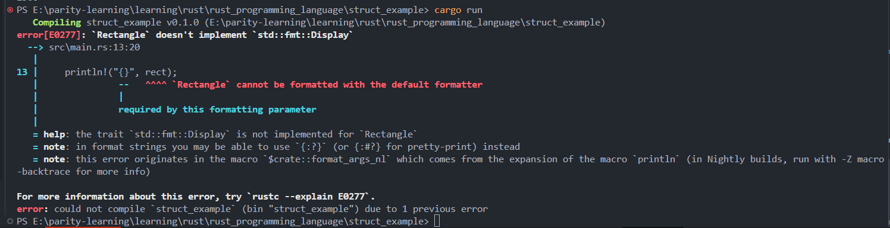
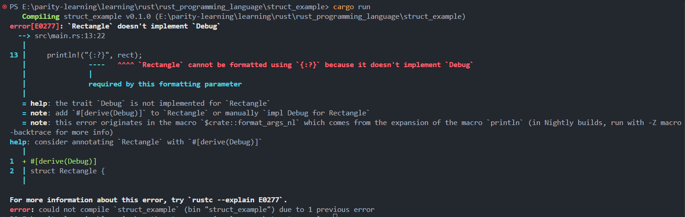

# Rust Debug Trait Implementation and Formatting Output Analysis

**Author**: Peile Wu  
**Contact**: peile.wu.1990@gmail.com  
**Date**: September 2, 2025

## Project Overview

This document analyzes a Rust struct formatting example that demonstrates how to resolve compilation errors by implementing the Debug trait and explores different formatting output methods.

## Code Structure Analysis

### Main Components

```rust
#[derive(Debug)] // Auto-derive Debug trait for Rectangle struct
struct Rectangle {
    width: u32,
    length: u32,
}
```

The program defines a `Rectangle` struct with width and length fields, automatically implementing the Debug trait through `#[derive(Debug)]`.

### Core Functionality

The program includes the following main features:

- Creating a Rectangle instance
- Calculating rectangle area
- Demonstrating different formatting output methods

## Compilation Error Analysis

### Error Screenshots

The development process encountered two sequential compilation errors, as shown in the provided terminal screenshots:

**Image 1: Display Trait Error**

- Shows the first compilation attempt using `{}` placeholder
- Error message: "Rectangle doesn't implement `std::fmt::Display`"
- Line 13: `println!("{}", rect);` causes the error

**Image 2: Debug Trait Error**

- Shows the second compilation attempt using `{:?}` placeholder
- Error message: "Rectangle doesn't implement `Debug`"
- Line 13: `println!("{:?}", rect);` still causes an error
- Compiler suggests adding `#[derive(Debug)]`

### Error 1: Display Trait Not Implemented

**Error Message**: `Rectangle doesn't implement std::fmt::Display`

```rust
println!("{}", rect); // Attempting to use {} formatting
```

**Root Cause**: The `{}` placeholder requires the type to implement the `std::fmt::Display` trait, but the Rectangle struct doesn't implement this trait.

**Solutions**:

- Use `{:?}` for Debug formatting output
- Or manually implement the Display trait



### Error 2: Debug Trait Not Implemented

**Error Message**: `Rectangle doesn't implement Debug`

```rust
println!("{:?}", rect); // Attempting to use {:?} formatting
```

**Root Cause**: The `{:?}` placeholder requires the type to implement the `std::fmt::Debug` trait.

**Solution**: Add `#[derive(Debug)]` before the struct definition



## Formatting Output Methods Comparison

### 1. `{}` - Display Formatting

- Requires implementing `std::fmt::Display` trait
- Used for user-friendly output
- Suitable for end-user readable formats

### 2. `{:?}` - Debug Formatting

- Requires implementing `std::fmt::Debug` trait
- Used for debugging purposes
- Can be auto-derived with `#[derive(Debug)]`

### 3. `{:#?}` - Pretty Debug Formatting

- Also requires implementing `std::fmt::Debug` trait
- Provides more readable multi-line formatted output
- Ideal for debugging complex structures

## Solution Implementation

### Final Working Code

```rust
#[derive(Debug)]
struct Rectangle {
    width: u32,
    length: u32,
}

fn main() {
    let rect = Rectangle {
        width: 30,
        length: 50,
    };

    // Calculate and output area
    println!("{}", area(&rect));

    // Use pretty Debug format to output struct
    println!("{:#?}", rect);
}

fn area(rect: &Rectangle) -> u32 {
    rect.width * rect.length
}
```

### Expected Output

```
1500
Rectangle {
    width: 30,
    length: 50,
}
```

## Key Technical Points

### Importance of Debug Trait

- Debug trait is the standard trait for debugging output in Rust
- Can be automatically derived with `#[derive(Debug)]`
- Essential debugging tool during development

### Formatting Macro Selection

- `println!("{}", value)` - Requires Display trait
- `println!("{:?}", value)` - Requires Debug trait, compact format
- `println!("{:#?}", value)` - Requires Debug trait, pretty format

### Best Practice Recommendations

1. Always derive Debug trait for structs used in debugging
2. Use `{:#?}` for more readable output format
3. Consider implementing Display trait for user-facing output
4. Leverage Rust compiler's detailed error messages to guide code fixes

## Error Resolution Workflow

1. **Identify Error**: Compiler clearly indicates missing trait
2. **Understand Requirements**: Analyze what type of formatting output is needed
3. **Choose Solution**: Derive Debug or implement Display
4. **Verify Fix**: Ensure code compiles and produces expected output

## Learning Outcomes

This example excellently demonstrates how Rust's type system ensures type safety through traits, and how the compiler provides helpful error messages to guide developers in problem resolution. The progression from Display error to Debug error to final solution illustrates Rust's emphasis on explicit trait implementation and the power of automatic trait derivation.

The step-by-step error resolution process shown in the terminal screenshots provides valuable insight into Rust's compilation feedback system and how it guides developers toward correct solutions.
