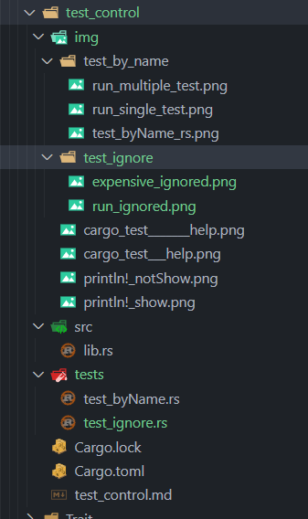
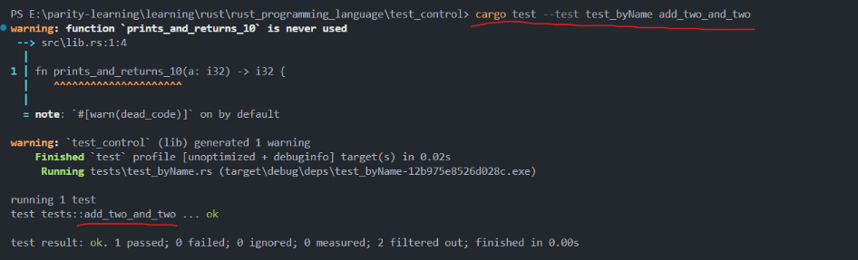
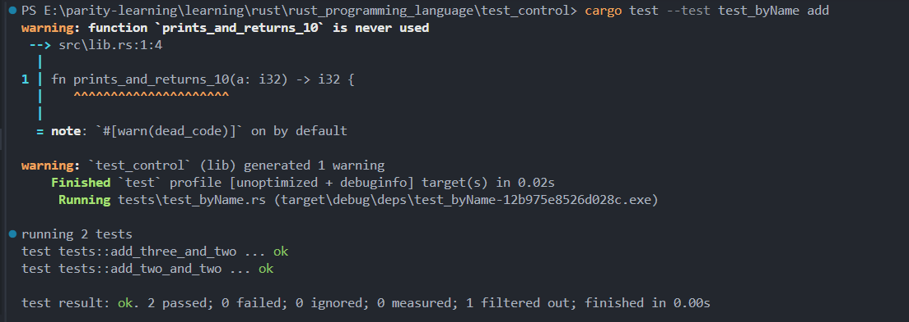
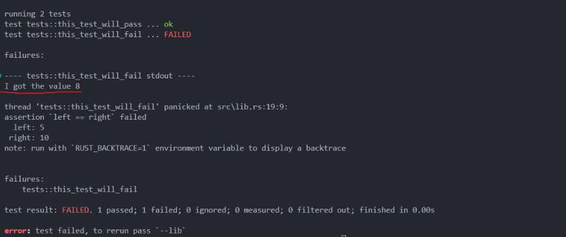
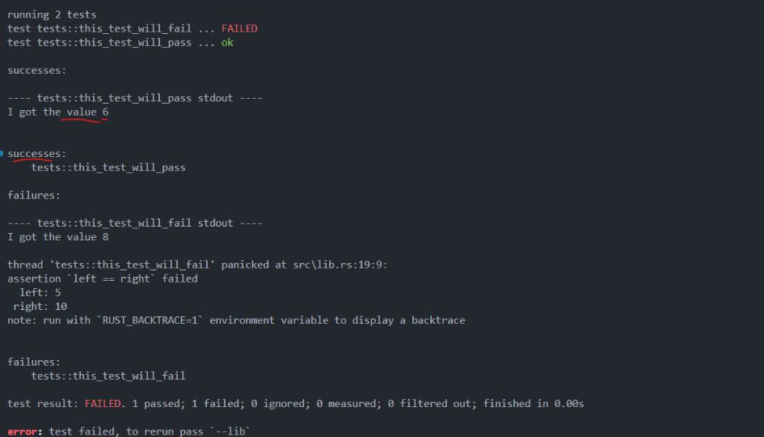
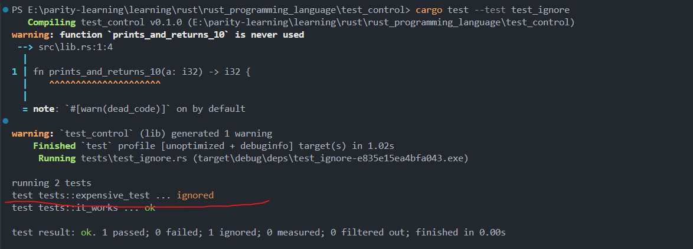
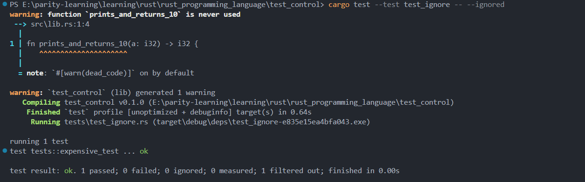

# Rust Test Control Guide

## Test Classification in Rust

Rust categorizes tests into two main types:

### Unit Tests

- **Characteristics**: Small, focused, test one module in isolation at a time
- **Access**: Can test private interfaces
- **Purpose**: Isolate a small piece of code to quickly determine if the code functions as expected
- **Location**: Generally placed in the same file as the code being tested in the `src` directory
- **Convention**: Each source code file should create a `tests` module to contain test functions, annotated with `#[cfg(test)]`

#### cfg (configuration) Annotation

The `#[cfg(test)]` annotation on the tests module:

- Only compiles and runs code when running `cargo test`
- Does not compile when running `cargo build`
- **cfg (configuration)** tells Rust that the following item should only be included under specified configuration options
- Configuration option `test`: Provided by Rust, used to compile and run tests
- Only `cargo test` will compile code, including helper functions and `#[test]` annotated functions in the module

#### Testing Private Functions

Rust allows testing private functions:

```rust
pub fn add_two(a: i32) -> i32 {
    internal_adder(a, 2)
}

fn internal_adder(a: i32, b: i32) -> i32 {
    a + b
}

#[cfg(test)]
mod tests {
    use super::*;

    #[test]
    fn it_works() {
        assert_eq!(4, internal_adder(2, 2)); // This test calls private function internal_adder
    }
}
```

### Integration Tests

- **Location**: Located completely outside the tested library, uses your code like any other external code
- **Access**: Can only use public interfaces
- **Scope**: May use multiple modules in each test
- **Configuration**: Integration tests are in different directories and don't need `#[cfg(test)]` annotation
- **Purpose**: Test whether multiple parts of the tested library work correctly together

## Project Structure



Based on the project structure, we can see:

```
test_control/
├── src/
│   ├── lib.rs
│   └── main.rs
├── tests/
│   ├── common/
│   │   └── mod.rs
│   ├── integration_test.rs
│   ├── test_byName.rs
│   └── test_ignore.rs
├── Cargo.toml
├── Cargo.lock
└── test_control.md
```

## Integration Tests Setup

### The tests Directory

- Create integration tests: Create a `tests` directory at the project root (parallel to the `src` directory)
- Cargo automatically looks for test files in this test directory
- Each test file in the `tests` directory is compiled as a separate crate
- Need to import the tested library
- No need for `#[cfg(test)]` annotation, the tests directory is specially treated
- Only `cargo test` will compile files in the tests directory

### Actual Project File Examples

#### lib.rs File Content

```rust
pub fn prints_and_returns_10(a: i32) -> i32 {
    println!("I got the value {}", a);
    10
}

#[cfg(test)]
mod tests {
    use super::*;

    #[test]
    fn this_test_will_pass() {
        let value = prints_and_returns_10(6);
        assert_eq!(10, value);
    }

    #[test]
    fn this_test_will_fail() {
        let value = prints_and_returns_10(8);
        assert_eq!(10, value);
    }
}
```

#### integration_test.rs File Content

```rust
use test_control; // To test functions in lib.rs, import package named in cargo.toml

mod common; // Importing the common module

#[test]
fn it_adds_two() {
    common::setup(); // in common folder, mod.rs
    assert_eq!(10, test_control::prints_and_returns_10(8));
}
```

#### common/mod.rs File Content

```rust
pub fn setup() {}
```

### Submodules in Integration Tests

- Each file in the `tests` directory is compiled as a separate crate
- These files don't share behavior (different from file rules under src)
- If you want to create a helper function to use in multiple integration test files:
  - Need to create a directory called `common` in the tests directory
  - Create a file called `mod.rs` in the common directory to contain helper functions

For this project, we use integration tests by creating a `tests` directory at the project root level (same level as `src`). This approach is recommended when you already have unit tests in your `lib.rs` file and want to run tests independently.

### Integration Test File Examples

#### Basic Integration Test

```rust
// tests/test_byName.rs
pub fn add_two(a: i32) -> i32 {
    a + 2
}

#[cfg(test)]
mod tests {
    use super::*;

    #[test]
    fn add_two_and_two() {
        assert_eq!(4, add_two(2));
    }

    #[test]
    fn add_three_and_two() {
        assert_eq!(5, add_two(3));
    }

    #[test]
    fn one_hundred() {
        assert_eq!(102, add_two(100));
    }
}
```

#### Integration Test with Ignored Tests

```rust
// tests/test_ignore.rs
#[cfg(test)]
mod tests {
    #[test]
    fn it_works() {
        assert_eq!(4, 2 + 2);
    }

    #[test]
    #[ignore]
    fn expensive_test() {
        assert_eq!(5, 1 + 1 + 1 + 1 + 1);
    }
}
```

## Running Specific Integration Tests

### Running Specific Integration Test Files

To run a specific integration test file:

```bash
cargo test --test test_byName
```

This command runs all tests within the `test_byName.rs` file.

### Running Single Test by Name

To run a single specific test function:

```bash
cargo test --test test_byName add_two_and_two
```



This runs only the `add_two_and_two` test function from the `test_byName.rs` file.

### Running Multiple Tests by Name Pattern

If you want to run multiple tests that match a pattern (e.g., all tests starting with "add"):

```bash
cargo test --test test_byName add
```



This command runs both `add_two_and_two` and `add_three_and_two` tests because both contain "add" in their names.

### Running Tests by Subset of Names

You can pass test names as arguments to `cargo test`. Note that you can only pass one pattern argument, but it can match multiple tests:

```bash
# Run tests containing "two" in their names
cargo test --test test_byName two

# Run tests containing "hundred" in their names
cargo test --test test_byName hundred
```

## Integration Tests for Binary Crates

If the project is a binary crate (only contains `src/main.rs` without `src/lib.rs`):

- Cannot create integration tests in the tests directory
- Cannot import functions from main.rs into scope
- Because only library crates can expose functions for other crates to use
- Binary crate means independent execution

**Solution**:

- Rust binary projects typically put logic in `lib.rs`
- Keep only simple calls in `main.rs` (some minimal glue code)
- This way, during integration testing, the project can be treated as a library crate
- Can access core logic code in this crate using `use`
- As long as the logic code is fine, the core functionality is fine

## Controlling Test Execution

The Cargo test framework provides multiple ways to control test execution behavior. By adding command-line arguments, we can modify the default behavior of `cargo test`.

### Default Test Behavior

Rust tests have the following default behaviors:

- **Parallel execution**: Uses multiple threads to run tests simultaneously for improved speed
- **Run all tests**: Executes all test cases in the project
- **Capture output**: Doesn't display `println!` and other output when tests pass, only shows output when tests fail

This design benefit makes test result output cleaner and easier to read test-related information.

## Command Line Arguments Classification

### Cargo Test Command Arguments

These arguments follow directly after `cargo test`:

```bash
cargo test --help
```


### Test Executable Arguments

These arguments need to be placed after `--`, passed directly to the test executable:

```bash
cargo test -- --help
```


## Parallel/Sequential Test Execution

### Parallel Execution (Default)

By default, Rust uses multiple threads to run tests in parallel, with the following characteristics:

- **Fast execution**: Multi-threaded concurrent execution
- **Important considerations**: Tests should not depend on each other
- **Avoid shared state**: Don't rely on shared resources like environment variables, working directories, etc.

### Controlling Thread Count

If you need to control concurrency or use single-threaded execution, you can use the `--test-threads` parameter:

```bash
# Run all tests using a single thread
cargo test -- --test-threads=1

# Use a specified number of threads
cargo test -- --test-threads=4
```

This is useful in the following situations:

- Tests have dependencies between them
- Need precise control over resource usage
- When debugging test issues

## Displaying Function Output

### Default Output Behavior

The Rust test library captures all content printed to standard output by default:

- **Test passes**: Doesn't display `println!` and other output content
- **Test fails**: Shows `println!` output and failure information

### Example Code Analysis

Based on the provided `lib.rs` file, here's how the output behavior works:

```rust
fn prints_and_returns_10(a: i32) -> i32 {
    println!("I got the value {}", a);
    10
}

#[cfg(test)]
mod tests {
    use super::*;

    #[test]
    fn this_test_will_pass() {
        let value = prints_and_returns_10(6);
        assert_eq!(10, value);
    }

    #[test]
    fn this_test_will_fail() {
        let value = prints_and_returns_10(8);
        assert_eq!(10, value);
    }
}
```

### Default Output Result

When running tests with default settings, you'll only see output from failing tests:



From the image, you can see:

- The successful test `this_test_will_pass` doesn't show `println!` output
- The failed test `this_test_will_fail` shows "I got the value 8" output

### Show All Output

If you want to see `println!` output from all tests (including successful ones), use:

```bash
cargo test -- --show-output
```



After using the `--show-output` parameter:

- Successful tests also display their `println!` output: "I got the value 6"
- Failed tests continue to show output and error information

## Test Selection Examples

### Running All Tests in Project

```bash
cargo test
```

### Running Only Integration Tests

```bash
cargo test --test '*'
```

### Running Specific Integration Test File

```bash
cargo test --test test_byName
```

### Running Specific Test Function in Integration Test

```bash
cargo test --test test_byName add_two_and_two
```

### Running Tests by Name Pattern in Integration Test

```bash
# Run all tests containing "add" in the name
cargo test --test test_byName add

# Run all tests containing "two" in the name
cargo test --test test_byName two
```

## Practical Tips

### Debugging Tests

1. **Use `--show-output`** to view all output for debugging
2. **Use `--test-threads=1`** to avoid concurrency issues
3. **Combine both**: `cargo test -- --test-threads=1 --show-output`

### Running Specific Tests

```bash
# Run tests whose names contain a specific string
cargo test specific_test_name

# Run tests from a specific module
cargo test tests::module_name

# Run specific integration test with pattern
cargo test --test test_file_name pattern
```

### Ignoring Tests

Sometimes you have tests that are time-consuming and you want to skip them during regular test runs to save time. You can use the `#[ignore]` attribute to mark these tests.

```rust
#[test]
#[ignore]
fn expensive_test() {
    // Time-consuming test code
}
```

#### Example: Test File with Ignored Tests

```rust
// tests/test_ignore.rs
#[cfg(test)]
mod tests {
    #[test]
    fn it_works() {
        assert_eq!(4, 2 + 2);
    }

    #[test]
    #[ignore]
    fn expensive_test() {
        assert_eq!(5, 1 + 1 + 1 + 1 + 1);
    }
}
```

#### Running Ignored Tests

**Important Note**: The `--ignored` parameter must be placed **after** `--`, not directly after `cargo test`.

```bash
# ❌ Wrong: This will cause an error
cargo test --test test_ignore --ignored

# ✅ Correct: Run only ignored tests
cargo test --test test_ignore -- --ignored

# ✅ Run all tests including ignored ones
cargo test --test test_ignore -- --include-ignored

# ✅ Run only normal tests (default behavior)
cargo test --test test_ignore
```

#### Test Execution Results

When running normal tests (default behavior):


The output shows:

- `it_works` test passes normally
- `expensive_test` is ignored (not executed)
- Result: "1 passed; 0 failed; 1 ignored"

When running only ignored tests:


The output shows:

- Only `expensive_test` is executed
- `it_works` is filtered out
- Result: "1 passed; 0 failed; 0 ignored; 1 filtered out"

#### Time-Efficient Testing Strategy

This approach allows for efficient time management:

- **During development**: Skip time-consuming tests with default `cargo test`
- **Before release**: Run all tests including ignored ones with `-- --include-ignored`
- **Specific testing**: Run only expensive tests when needed with `-- --ignored`

## Important Notes About Integration Tests

1. **No `#[cfg(test)]` needed**: Integration test files don't need the `#[cfg(test)]` attribute at the file level
2. **Import your crate**: Use `use your_crate_name::*;` to import functions from your library
3. **Independent execution**: Each integration test file is compiled as a separate crate
4. **Public API only**: Integration tests can only access public APIs of your crate
5. **Common modules**: Use `tests/common/mod.rs` pattern for shared helper functions across integration tests

## Summary

Cargo's test control features provide flexible test execution options:

- **Test Classification**: Clear distinction between unit tests and integration tests, each with different scopes and purposes
- **Flexible execution control**: Support both parallel and sequential execution modes
- **Selective output display**: Control whether to display test output
- **Run specific tests by name**: Support pattern matching and precise test selection
- **Ignore test functionality**: Skip time-consuming tests to improve development efficiency
- **Integration test architecture**: Complete integration test support through independent tests directory

Proper use of these features can significantly improve testing efficiency and development experience. The integration test approach is particularly useful when you want to test your crate's public API in isolation from unit tests, while unit tests allow you to test internal implementation details including private functions.
